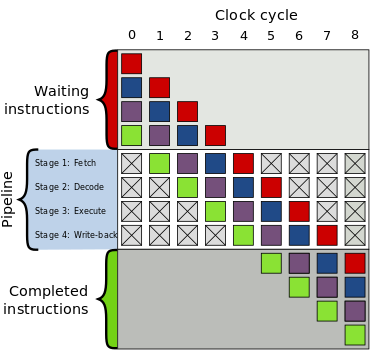
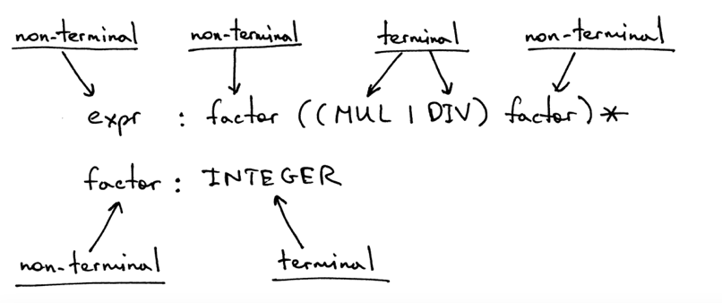
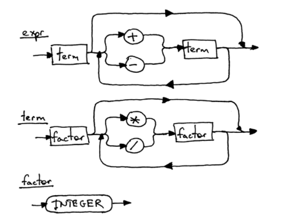

> Theme: App Architecture & Low-programming（Compiler & Interpreter）    
> Source Code Read Plan: Still Aspect      
> Reference Book List: objc App Architecture

# 2018/03/01 - 2018/03/02

[推荐：C语言实现 OC 运行时一步步推倒过程](https://github.com/colourful987/2018-Read-Record/blob/master/2018-02/resource/C_IMP_Runtime.md)


# 2018/03/03
[函数调用栈帧过程带图详解](http://blog.csdn.net/IT_10/article/details/52986350)

主要学习了 C 语言函数 stack frame 的知识以及一些简单的汇编指令：`mov 目的操作数 源操作数` 即源操作赋值给目的操作数；`lea edi,[ebp-44h]  mov acx,11h  mov eax,0CCCCCCCCh` edi存储起始地址，acx记录填充次数，eax存储要填充的占位数据；ebp 和 esp 是调用函数过程中比较重要的两个寄存器，其中ebp最为重要，取变量地址都是通过ebp+offset来取值。
> 这里有个坑没有填：文中说到的函数帧是先push 传参，然后push ebp，接着是call 返回地址，最后是函数的临时变量；而之前看到的是push ebp，push 返回地址，最后才是传参和临时变量。另外对于 `int x = 10;` 编译器会编译成如下命令`mov dword ptr [ebp-4],0Ah`，其实就是把 0Ah 这个值写入 `ebp-4` 地址上，至于 `dword ptr` 修饰`[ebp-4]` 是个四字节地址；而访问变量 x 的操作，其实也是对内存的操作。

Note: 编译之后压根不存在我们定义的数据结构！

其他关于函数调用栈的参考文章:    

[通过swap代码分析C语言指针在汇编级别的实现](http://www.cnblogs.com/inevermore/p/4393124.html)

[函数调用过程（ebp，esp） ](http://blog.163.com/yichangjun1989@126/blog/static/131972028201442221956603/)

[C 语言指针与汇编地址（一）](http://blog.csdn.net/lanchunhui/article/details/51366513)

# 2018/03/04
[objc App Architecture Introduction](https://www.objc.io/books/app-architecture/)     
设计一款应用时候可以从以下五点入手：
1. Construction: 谁创建View和Model，以及两者之间的关联；
2. Update the model: 哪些 View Action 处理需要修改model，比如界面上的按钮点击等；
3. Changing the view: model data 的改动又该如何反应到视图上；
4. View-state
5. Testing

主流应用架构模式：
* MVC
* OO-MVC，弱Model版本的 MVC，是 Online-Only Model-View-Controller的缩写，比如网页开发中，弱化了Model层，数据源来自服务端，然后呈现到View上
* MVVM，需要双向绑定
* The Elm Architecture
* Model-View-Controller+ViewState
* ModelAdapter-ViewBinder

后三者应该是借鉴其他编程语言开发中的模式，改写应用到iOS，这个应该比较有意思，待学习。


# 2018/03/05 ~ 2018/03/08
这几天在改[iOS and macOS Performance Tuning](https://www.amazon.com/iOS-macOS-Performance-Tuning-Objective-C/dp/0321842847) 译书的修改意见，简单说下其中提到的pipeline流水线技术，主要参考了wiki的解释：
> 指令流水线是为了让计算机和其他数字电子设备能够加速指令的通过速度（单位时间内被运行的指令数量，吞吐量？）而设计的技术。

参考工业流水线做法，一个完整的产品需要经过工艺1（工人A负责），工艺2（工人B负责），以此类推...
这样的好处在于工人不需要“全能”，节省教学成本，他只需要懂自己步骤的工艺就可以重复劳动了。

其实CPU同样如此，内部有很多电子元器件组成，触发器，逻辑门等，其中每个电子器件各自独立，功能也是同流水线的工人一样很专一。

当代CPU都是利用时钟频率驱动的，而CPU是由内部的逻辑门与触发器组成。当受到时钟频率触发时，触发器得到新的数值，并且逻辑门需要一段时间来解析出新的数值，而当受到下一个时钟频率触发时触发器又得到新的数值，以此类推。而借由逻辑门分散成很多小区块，再让触发器链接这些小区块组，使逻辑门输出正确数值的时间延迟得以减少，这样一来就可以减少指令运行所需要的周期。（摘自wiki，若对计算机组成有兴趣，可以阅读 Code 一书）

以 RISC 流水线来说，被分为5个步骤，每个步骤之间用触发器链接，意思就是前一个步骤的输出作为下一个步骤的输出，而触发器的两端就是输入和输出，可以进行数据保持（在一段时间内）
1. 读取指令
2. 指令解码与读取寄存器
3. 运行
4. 内存访问
5. 写回寄存器

一条指令实际是由我们定义的一系列步骤，而不是一条指令对应一个物理层面的电路模块（有待确认）。

摘自wiki的一个示例：

上图展示了4层流水线的示意图：
1. 读取指令（Fetch）
2. 指令解码（Decode）
3. 运行指令（Execute）
4. 写回运行结果（Write-back）

> 疑惑：每个步骤实际对应一个复杂的功能电路，那它们是如何保证每个步骤都是在一个时钟周期完成呢？还是说并非每个步骤时间相同————但是这样的话上图x轴又不对了。

图中不同颜色的方块分别对应一条指令，而中间的 pipeline 流水线纵向分为四个步骤（不要误解成指令）：Fetch、Decode、Execute和 Write-back。X轴方向是时间，注意到第一步Fetch横向去看，每次都是读入一条指令，第一个时钟读入了绿色指令，第二个时钟读入紫色，接着是蓝色和红色指令，它就像一个工人每个时钟读一条指令，下个时钟到来时候把读入的指令传给下一个步骤Decode，接着继续读指令；第二个步骤同样如此，只负责Decode一条指令，然后传给下一个步骤。

现在罗列下绿，紫，蓝，红四条指令执行开始到完成，开始和结束分别对应的时钟周期坐标（注意x轴方向）：
* 绿色指令：时钟周期1开始读入---> 时钟周期5结束，经历了Fetch,Decode，Excute,Write-back
* 紫色指令：时钟周期2开始读入---> 时钟周期6结束，同上
* 蓝色指令：时钟周期3开始读入---> 时钟周期7结束，同上
* 宏色指令：时钟周期4开始读入---> 时钟周期8结束，同上

如果是非流水线的话，应该是只有当一条指令执行完四个步骤的时候，才开始下一条指令执行四个步骤，也就是说执行两条指令要花费8个时钟周期，每条指令花费4个周期；而应用流水线技术，我们执行了4条指令，每条指令花费2个周期。但是随着指令源源不断地输入执行，最终相当于一个时钟周期执行一条指令。

> 我的理解：假设执行的指令无穷尽，那么随着时间推移，流水线中的每个步骤都处于忙碌状态，不可能有怠工的情况（理想情况下），从宏观去看这条流水线的工作情况，A在Fetch 指令4，B在Decode 指令 3，C在Excute指令2，D在Write-back指令1，其实我们认为A，B，C，D同时在对“同一个指令”操作，感觉就像一个时钟执行了一条指令。

当然非流水线的执行方式设计简单，成本低，而且指令和指令互不影响，出错概率低吧。

另外在修改译书时发现`阿姆达尔（Amdahl）定律`蛮有意思，关于内核数量和程序中并发代码比值对执行时间的影响。

# 2018/03/09（编译器和解释器专题）
Ruslan 写的[Let’s Build A Simple Interpreter](https://ruslanspivak.com/lsbasi-part1/) 专题总共有14节。
进度：read chapter 1，过于基础，暂时没有什么感悟和理解，只当打卡。

另外看评论Jack Crenshaw留言说文章貌似有“抄袭”嫌疑，没有细看，给出Jack Crenshaw 关于编译器和解释器的文章，有完整的pdf下载
[Let's Build a Compiler](https://compilers.iecc.com/crenshaw/)

# 2018/03/10
[Let’s Build A Simple Interpreter part2](https://ruslanspivak.com/lsbasi-part2/)    
* 借助 Scanner（扫描器）从 Source Code->Token的过程：Token 囊括了程序代码中所有的字符，比如整数，`+,-,*,/,= ...`，使用Token数据结构表示。在读入字符串parse后分别存储到一个个Token中，这一步称之为Lexical Analyzer(词法分析)；
* Lexeme 可以是一个或多个字符串（Note:比如"+","-"，也可以是整数“123”），毕竟我们输入的代码本质还是一长串字符串，由我们“分析”输入的“词”，然后将其Map到对应的Token结构中；
* 本节中，词法分析之后紧跟就是Interpreting(就是应用+和-)，但是目前逻辑代码是硬编码的，也就是if-else分支处理，目前仅仅只是做了空白字符串判断，一些特殊的还未判断。

# 2018/03/11
[Let’s Build A Simple Interpreter part3](https://ruslanspivak.com/lsbasi-part3/)   

本节学习稍微复杂的计算器表达式，例如 “1+2-100+123”这种表达式，顺便用oc写了个demo。

[OC-Lexical_Analyzer_UI](./resource/Lexical_Analyzer_UI)

[OC-Lexical_Analyzer_Terminal](./resource/Lexical_Analyzer_Terminal)

oc 终端接受字符串输入有两种方式：
```oc
// c语言方式
char *cstring = malloc(sizeof(char) * 100);
scanf("%s", cstring);
NSString *string = [NSString stringWithUTF8String:cstring];

// oc 层面
// 当然还可以继续调用 `[NSString stringByTrimmingCharactersInSet:[NSCharacterSet newlineCharacterSet]` 将接收的字符串去除空格和换行等
NSData *data = [[NSFileHandle fileHandleWithStandardInput] availableData];
NSString *string = [[NSString alloc] initWithData:data encoding:NSUTF8StringEncoding];
```

此次在学习过程中遇到了个小坑，对于带空格的输入,`scanf`接收总是出问题，最后查了[c++官方文档说明](http://www.cplusplus.com/reference/cstdio/scanf/)：

> Any number of non-whitespace characters, stopping at the first whitespace character found. A terminating null character is automatically added at the end of the stored sequence.

即对于输入format为`%s`时，接收字符串直到遇到第一个为空格的字符算作结束，然后接收到的字符串后面拼接`null(\0)`。

解决方法可以使用`gets()`函数，另外如何读取带空格的字符串，有一种比较有意思的格式：
```
scanf(” %[^\n]s”,a);
```
出自[How to use scanf to read Strings with Spaces](https://gpraveenkumar.wordpress.com/2009/06/10/how-to-use-scanf-to-read-string-with-space/)

# 2018/03/14
[Let’s Build A Simple Interpreter part4](https://ruslanspivak.com/lsbasi-part4/)       
[Let’s Build A Simple Interpreter part5](https://ruslanspivak.com/lsbasi-part5/)      
[Let’s Build A Simple Interpreter part6](https://ruslanspivak.com/lsbasi-part6/)      

文章目的是为了实现一个简单的算术解释器，使用巴科斯-诺尔范式（BNF —— Backus-Naur Form）对诸如`1*2/3*4/5`的表达式求值。

1. 首先引入表达式 `expr` 的概念，`1*2/3*4/5` 毫无疑问是一个`expr`；
2. 单独一个整数 `1`，`2` 抽象意义上也是一个表达式。对于整数这种特殊的“expr”（其实就是单纯的返回值，类似于代码中的 {return value}），称之为**factor(因子)**

> factor(因子)可理解为特殊的 `expr`，定义如下：任何运算符放置其任意一边都不会导致这个表达式内部其他部分分离出来，成为这个运算符的运算操作数。


* 举例1： `1` 这个“表达式”，是一个基本单元，实际上内部无法再分割了，那么在`1`的左右两侧放置运算符（譬如 *1，或是1/），显然不会将表达式中的其他部分分离出来；
* 反例： 而类似于 `2/3` 这种表达式，我们在左侧放置一个 `*` 号，显然会让内部的 `2` 和乘号左侧的操作数结合了；
* 举例2：除了整数这种特殊的可称之为factor外，我们熟知的用括号括起来的表达式也称之为factor，譬如`(1*2/3*4/5)`这个整体称之为factor，我们在其左右两侧放置操作符，不会把表达式中的其他部分分离出来！这种形式的factor我们可以表示成`(expr)`，左右括号(parenthesis)包括一个expr表达式。

回到正题`1*2/3*4/5`，在引入`expr` 和 `factor` 之后，表达式可写成 `factor*factor/factor*factor/factor`；进一步发现形式不过是 `factor*factor` or `factor/factor` ，借鉴正则表达式中的`|`或概念，我们可以改写成 `factor (MUL|DIV) factor (MUL|DIV) factor (MUL|DIV) `；其中 ` (MUL|DIV)factor`是重复部分，这在正则表达式中用 `()*`来表示；这样就得到了最终的 `factor ((MUL|DIV)factor)* `，其中 `factor` 此时只表示为整数 `INTEGER`。

继续引入 `non-terminal` 和 `terminal` 的概念，即非终结和终结：



> Note: factor 同样是一个表达式。首先我们要做的是重复替换一个 non-terminal 成 terminal，直到得到第一个我们想要的诸如表达式(terminal MUL|DIV terminal)，比如碰到第一个factor，它是non-terminal的，因此继续对这个factor替换，得到具体一个整数（terminal）;紧接着我们会得到一个MUL或DIV，这是terminal;继续对下一个factor做替换；最后满足（INTEGER（MUL | DIV）INTEGER)的小expr，求值得到结果作为下一个expr的输入，重复该步骤。

但复杂操作时，会涉及优先级的问题，比如*和/的优先级高于+和-。如何构建优先级的语法需要涉及以下两个规则：

1. 为每个优先级定义一个**non-terminal**。而定义的**non-terminal**的body也是有格式要求的：`other-non-terminal (操作符) other-non-terminal`(可以重复多个此表达式)，表达式中的操作符即当前优先级定义的符号；而other-non-terminal为更高级优先级中的non-terminal；
2. 如果我们有N个Level的操作优先级，那么意味着我们要创建 N+1 个 **non-terminal**，每个 **non-terminal** 的body正如上面说的由当前Level的操作符加上高优先级的两个 **non-terminal**。

> 再简单说下目前对 non-terminal 的理解：有点像一个表达式的别名，编码中就像是定义了一个变量`var nameOfNonTerminal = { body }`，正如上面图中所展示的，factor 是一个 non-terminal，body 为 INTEGER； expr 也是一个 non-terminal，body为 `factor ((MUL | DIV) factor) *`。

四则运算+，-，*，/中有两个优先级，高优先级的 *和/，接着+和-同一级，按照上面的说定义如下几个non-terminal和terminal:




对于 +，- 优先级我们定义了 `term ((ADD | sub) term) * `；其中 term 是更高优先级的**non-terminal**，属于 *，/ 优先级：`factor ((MUL | DIV) factor) *`；factor 为整数，优先级最高！

> 表达式评估求值必须遵循一个规则：碰到一个non-terminal就必须替换成仅含terminal的表达式。

因此例子中expr表达式入口第一个遇到 non-terminal term 就要开始替换，它属于高一级优先级的*和/；而term入口第一个遇到的 non-terminal又是 factor（因此又要替换！），属于更高一级的 INTEGER，；

优先级的实现就这么搞定了！再回顾下上面的图，之所以把优先级低的先放在最外层，然后立马解释高一层的优先级non-terminal，”层层深入“，直至最里面优先级最高的且替换成一个 terminal，再一层层返回。
```
--> Level最低
      |—-> Level稍高
            |--> ...
                  |--> Level最高
```

# 2018/03/17

[Let’s Build A Simple Interpreter part7](https://ruslanspivak.com/lsbasi-part7/)    

> Lexer -> Parser -> Parser Tree -> Interpret。

Parser 到 Parser Tree 前文都是使用 BNF 范式，引入了 expr， term， factor 三个 non-terminal 和 terminal的 + - * /，每个 non-terminal 感觉就是一个表达式的别名，body就是表达式的具体内容，body会包含优先级更高的两个non-terminal以及当前优先级的符号。

Parser Tree 的每个Node都是一个 non-terminal，从某种意义上来说包含了特定的语法，比如 + ，-，*，/。

关于 AST 是本章刚引入的概念，Abstract Syntax Tree ———— 抽象语法树，AST 较之 Parser Tree，前者的节点可以是操作符也可以操作数，不像后者是一个 non-terminal，内涵具体的一个语法。

本节简单介绍了下 AST ，我目前只觉得换了种数据结构呈现表达式而已，理解还不够深入。


