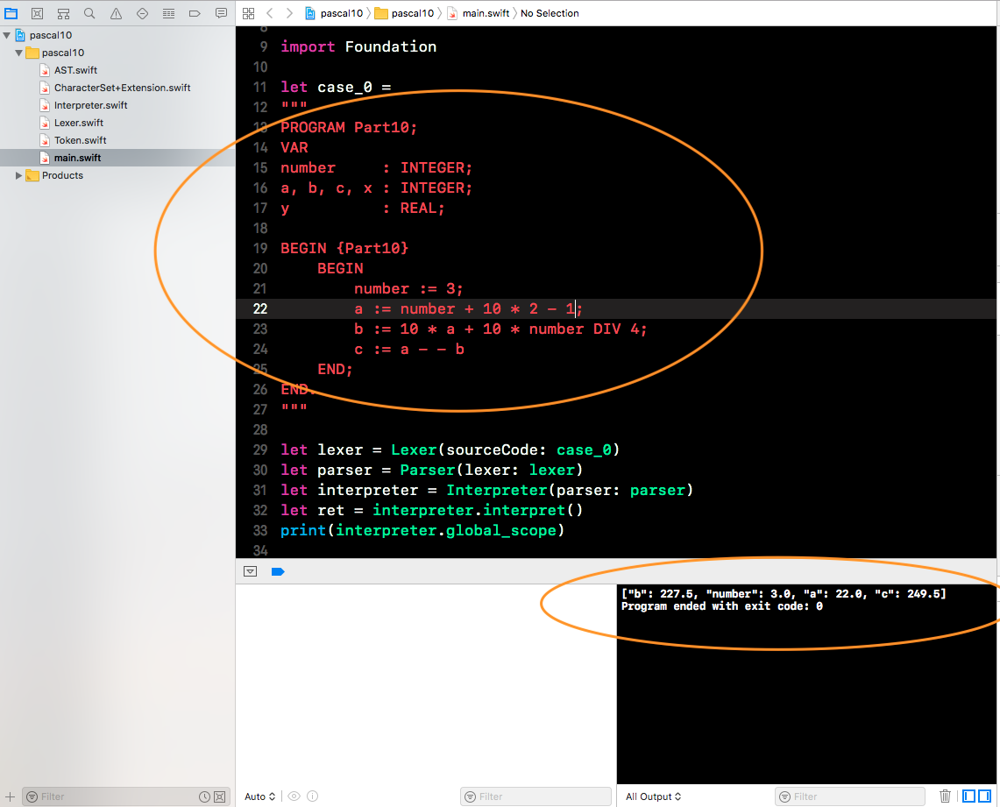
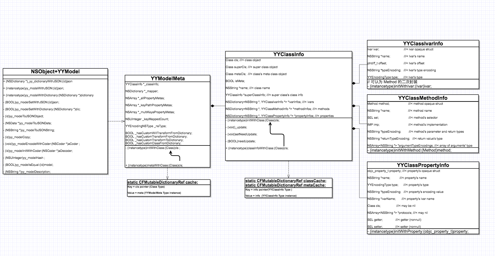
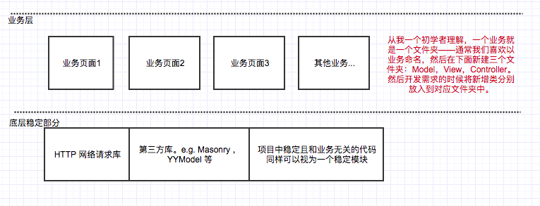

> Theme: Charts For Stock & 应用模块化和解耦
> Source Code Read Plan: Charts | AppLord | JLRoutes ...    
> Reference Book List: 《Just For Fun》

# 2018/04/01
这两天简单读了下 [《Just For Fun》](https://book.douban.com/subject/1451172/) ，起初我以为 Linus Torvalds 的自传无非包含：
1. Linus Torvalds 家庭环境，如何造就了这位天才；
2. Linux 系统是如何诞生的；
3. Linus Torvalds 对 Linus 的开源态度，曾经是否考虑过商业化追求利益，事实证明在理查德.斯托曼(RMS)的先驱下(就是发布GPL开源协议牛人)，Linus 也是始终坚定不移的站在了开源阵营；当然关于财富，想必很多人和我一样非常好奇，因此网上简单搜了下：年薪1000万刀，身价15亿美元（这只是网上流传，无法考证），我觉得对于 Linus 做出的共享，这些财富又算得了什么呢？想想没有 Linux 系统，之后的服务端系统，Android，Git 等等将不复存在————当然不否认会出现其他替代品，正如Git就是因为BitKeeper不再为Linux提供版本管理服务，Linus和其他几个朋友花几星期时间写出来的，ORZ... 时代不会因为 Linus 而停止，但他的贡献值得肯定和赞美，鬼知道替代品是不是以收费，闭源形式出现呢？
4. Linus 性格腼腆，这是很多文章和杂志都有提及，这很符合大部分程序员的特性，hhh，不过话说回来，Linus 说自己第一次演讲并不顺利，之后几次也是如此，但随着不断邀约演讲，他慢慢克服了上述的紧张心理，原因是他觉得自己尼玛对Linux系统那么熟了，怕什么。讲些当初在设计Linux系统时碰到的问题和解决思路不就可以组成一个完整的演讲了嘛，此处再次膜拜！真是一个耿直的大神；
5. 最后自然是流传的 Linus 和 乔布斯 对话了，其实也没什么，正是因为 Linus 对 MacOS 的闭源做法嗤之以鼻————Mach内核开源又如何，又不是把整个操作系统开源！ 反正最后不了了之。

而真正读完整本传记的时候，我发现得到的东西太让我惊讶了， Linus 竟然有大半是在讲述技术方面，设计 Linux 时候遇到的问题，解决问题，后续考虑等等，虽说只是简单阐述，但也足够让我这种小白了解到linux系统发展史————如何从一个极其简单的系统一步步发展到几千万行的代码量，我爱死这种叙述方式了，Linus 果然与众不同！

自传之外还提及了一些Linus出生地芬兰的趣事，比如桑拿😂，赫尔辛基冬天贼冷。

> 摘自Linus关于三件对生活有意义的事：1.生存 2.社会秩序 3.娱乐。生活中所有的事就是要你达到第三个阶段。一旦达到了第三个阶段，这辈子你就算成功了。但是你得先超越前两个阶段。

Swift不知不觉已经更新到4.1版本了，我已经很少关注了，知识小集出了 [Swift 4.1 新特性概览](https://mp.weixin.qq.com/s/2PNE2yPIiyn4y-cqHZgWiQ)，现在简单过一下。

# 2018/04/07
THObserversAndBinders 源码初窥，其实就是为每个属性观察事件实例化一个中间件处理，中间件处理KVO的回调，而每个中间件必须要被持有。[总结链接传送门](https://github.com/colourful987/2018-Read-Record/blob/master/Content/iOS/THObserversAndBinders/如何实现一个优雅的KVO和KVB中间件.md)

# 2018/04/08
THObserversAndBinders 按照源码Coding，过程中想到几个问题：
1. 对于`NSMutableArray、NSMutableSet`类型的属性，如何才能触发通知？调用`removeAtIndex:`或是 `addObject` 可以吗？
2. 关于`addObserver: forKeyPath: options: context:` 接口中的 options 有什么用？通常我们都是不假思索的填充 `NSKeyValueObservingOptionNew | NSKeyValueObservingOptionOld`（0x01 | 0x02 = 0x03），直接设置option=0又会怎么样呢？
3. 通知回调接口中的 change 字典，我们可以使用 `NSKeyValueChangeKey` 类型的键去取值，分别是`NSKeyValueChangeKindKey`、`NSKeyValueChangeNewKey`、`NSKeyValueChangeOldKey`、`NSKeyValueChangeIndexesKey`和`NSKeyValueChangeNotificationIsPriorKey`，什么情况下我们可以通过这些key取到值，什么时候取不到(即为null)

带着这些问题我测试了下：
1. 关于集合，调用`removeAtIndex`这些方法并不会触发通知回调，参照接口注释，如下即可触发:

```
[[_observedObject mutableArrayValueForKey:@"arrayPropertyName"] addObjectsFromArray:@[@3,@4]];
```
回调方法中，`change[NSKeyValueChangeKindKey]` 的值为 2 表示插入操作，而不再是 1 Setting操作。

2. options 相当于告诉观察者当发生改变时，你把我指定的变化值放到 change 字典中传过来。倘若你设置 options = 0，当发生变动时会触发回调方法，但是 change 字典中并没有存相应的值，唯一存的key就是 `NSKeyValueChangeKindKey` 告知你变动的类型，一般都是Setting。
3. 只要触发回调，change 字典必定有 `NSKeyValueChangeKindKey` 键以及对应的值，至于触发类型是`NSKeyValueChangeSetting`、`NSKeyValueChangeInsertion`或是其他，就需要用 `mutableArrayValueForKey` 这种方式取到值，然后在进行`add` `remove` 操作。

# 2018/04/09
实现了 KVO 的 Binder，但是弊端很明显，依赖只能是1对1，而不是多对1，毕竟有些属性值是依赖多个其他值的。

* [x] 🏆[THObserversAndBinders](https://github.com/th-in-gs/THObserversAndBinders)源码阅读和总结

[如何实现一个优雅的KVO和KVB中间件](https://github.com/colourful987/2018-Read-Record/blob/master/Content/iOS/THObserversAndBinders/如何实现一个优雅的KVO和KVB中间件.md)

# 2018/04/10
[Swift4.0 String 基础语法改动](https://github.com/colourful987/2018-Read-Record/blob/master/Content/iOS/Swift4%20String%20基础语法改动.md)

改动的几个重点都写了，顺便把 Swift Functional Programming 一书中的解析器小节代码更新了一把。

# 2018/04/12
Swift Struct 闭包捕获和 mutating 使用      
[Stckoverflow 上对 Swift and mutating struct 的解释](https://stackoverflow.com/questions/24035648/swift-and-mutating-struct)

> 问题：为什么struct结构体变量在外部可以修改成员变量，而struct的内部方法默认是不允许更改的，除非加上 mutating关键字。为什么这么做？这么实现理由是啥

首先有种观点是错的：struct是值类型，所以是不可变的，提出这个观点的不在少数。可变和不可变和类型并没有关系，而是struct方法内部成员storage标识的状态：可变还是不可变。 ps：可变等同于可修改。

想象下，结构体成员变量在内存中的分布，然后通过 `let` `var`来标识内存是否上锁————一旦上锁意味着不可变，即使是mutating的方法。比如：
```objective-c
struct Person {
  let name:String
  var age:Int
}

var p = Person(...)
```

`let` 关键字声明使得名字的内存被上锁，无法修改，`var` 则是可以。

倘若用 `let p = Person()` 实例化对象，那么结构体中所有的成员都会被上锁！不允许被修改。

回到结构体内部方法的声明，前面说到默认是 `immutable`，即不可修改内部的实例变量，即使内存没有被上锁（没有用let标识声明）。

> 但是我依然没想通，假设结构体方法没有mutating关键字修饰，就是能在方法内部修改那些`var`关键字声明的变量，倘若结构体是用let声明的，根据前面说的内存都会上锁，同样不允许修改，貌似也没啥问题啊。再次诚心求教各方大佬为何这么设计，我的邮箱mcxcode@163.com

# 2018/04/15
撸了下 Interperet Swift 版本，主要借助了 enum 的 associated type 特性。总体感觉还是觉得从python翻译成swift，但是自己思考了一些，也用swift自己的特性实现，避免只做“翻译官”。

[用 Swift 实现一个 pascal interpreter](https://github.com/colourful987/2018-Read-Record/tree/master/Content/iOS/Pascal%20Interperter/Swift%20Version)

今天突然想到 `THObserversAndBinders` 是否可以使用 Invocation 来实现 target-action 呢？但是考虑到block形式使得底层有一套实现了，target-action是基于block的二次封装调用，如果用 Invocation 可能要新加一些接口。不过 Talk is cheap, show me the code!

[pascal 10](https://github.com/colourful987/2018-Read-Record/tree/master/Content/iOS/Pascal%20Interperter/Swift%20Version/pascal10)已经基本算的上是一个pascal解释器了，能够简单支持变量类型，赋值操作等，当然类似for循环这些都不行。运行结果如下图所示：

 

# 2018/04/16
pascal11 新增一个 SymbolTable 和 SymbolTableBuilder，目的是生成一张变量映射表，不进行任何 Interpret。目前 pascal11 存在很多细节上的问题，尽管输出没有问题，但是思路上没有完全理顺。


# 2018/04/18
四月状态不佳，目标不够明确，专注度不够，经常一个知识点并未完全掌握或者处于效率极低的理解中，又突然抽风式地移步到另外一块领域，导致 context 切换过于频繁，造成很大程度地时间精力浪费。因此今天再次明确了下目标：

* 关于 Charts，其实一直跟进状态，但是并未记录在此，若方案成熟会写一个总结；
* 关于 SIP，投入了一定时间精力（差不多3-4天），将之前用 python 实现的解释器用 swift 重新实现了，下半月会自己定grammer，expr，symbol等实现一门“简单语言”，目标是实现var-declaration，assign-statement，for statement，while-statement等简单语法
* 模块化和架构，感觉还是要提上日程。搜了下相关文章，筛选后罗列记录下：
  - [x] [模块化与解耦 --刘坤](https://blog.cnbluebox.com/blog/2015/11/28/module-and-decoupling/) 文章篇幅不长，概念也是从简阐述，适合入口篇，但是文章并未直接给出具体的一套方案。[AppLord](https://github.com/NianJi/AppLord) 和 [JLRoute](https://github.com/joeldev/JLRoutes)源码建议阅读，前者是作者写的一个简单方案，提供一种思路；后者面向应用；
  - [x] [iOS组件化方案探索](https://link.jianshu.com/?t=http%3A%2F%2Fblog.cnbang.net%2Ftech%2F3080%2F)  bang 写的非常浅显易懂，且配合代码讲解，不过对于protocol-class方式，不知道是因为本身这种方式让人难以理解还是我自己理解问题，暂时不太清晰；
  - [x] [浅析iOS组件化设计](https://link.jianshu.com/?t=https%3A%2F%2Fskyline75489.github.io%2Fpost%2F2016-3-16_ios_module_design.html) 
  - [ ] [蘑菇街的组件化之路](https://link.jianshu.com/?t=http%3A%2F%2Flimboy.me%2Ftech%2F2016%2F03%2F10%2Fmgj-components.html)  
  - [ ] [蘑菇街组件化之路续](https://link.jianshu.com/?t=http%3A%2F%2Flimboy.me%2Ftech%2F2016%2F03%2F14%2Fmgj-components-continued.html) 
  - [ ] [iOS应用架构谈 组件化方案](https://link.jianshu.com/?t=https%3A%2F%2Fcasatwy.com%2FiOS-Modulization.html) 拜读过，感觉似懂非懂。ORZ... 
  - [ ] [组件化----路由设计思路分析 ](https://www.jianshu.com/p/76da56b3bd55) 
  - [ ] [组件架构漫谈](https://www.jianshu.com/p/67a6004f6930) 
  - [ ] [iOS组件化思路－大神博客研读和思考 ](https://www.jianshu.com/p/afb9b52143d4) 

> read a lot ≠ understand ≠ apply ≠ do whatever you want ，Talk is cheap，show me the code。当然，coding前必须要有方案，而且不是泛泛而谈的那种。

# 2018/04/22
YYModel 我思考了两点：一：JSON 数据流，苹果API提供了一套接口帮助我们将json数据流转成字典类型，这里建议自己写一个简单的 JSON Parser有助于理解，规则也很简单：`{ }` 中括号标识字典，`[]`标识数组，`{`或者`[`后读入的第一个`"`双引号标识一个key键名称，直到读入下一个`"`双引号，而`:`冒号标识之后读入值，`String`类型依旧以`""`双引号包括，而`Number`类型则直接以数字表示，当然可能依然是字典`{}`或者数组`[]`；二：YYModel 能够避免我们自定义Model的构造方法中写满一堆 key 取值，然后赋值给属性的语句，这里用到的类型反射，前提是我们定义的类必须和JSON数据流中的描述保持一致，比如json数据中 `{"lastName":"John"}`，那么对应的属性名称也是`lastName`，这样在动态解析中我们才能反射然后赋值 `John` 给 `self.lastName`。当然有时候JSON数据流中的定义的名称并不是我们想要的，可能后端用缩写`ln`表示`lastName`，我们可不想在Model也用`ln`，因此我们需要一个映射表，`ln->lastName`。

[YYModel源码阅读](https://github.com/colourful987/2018-Read-Record/blob/master/Content/iOS/YYModel/YYModel源码阅读.md)，暂时撸了第一节，参考意义不大。

# 2018/04/23
[Making your iOS application easy to read with these simple steps.](https://medium.com/ios-os-x-development/making-your-ios-application-easy-to-read-with-these-simple-steps-b63067900b72)
文章并未过多提及编码规范，主要举例说明如何提高代码阅读性，使用如下四种形式分割代码，达到函数遵循单一职责的目的：

```
1. Informer   functions
2. Management functions
3. Router     functions
4. Execution  functions
```
关于其他：
1. 尽量避免 `ifNeeded` 这种模棱两可，“暧昧”的措辞，毕竟要让其他代码阅读者去猜不是件好事；
2. 关于 `is` 前缀问题，在内部使用时，不建议加，而对外开放接口时，建议加上，原因是外部调用经常以 `if containView.isHidden` 形式，代码可读性高，而内部是`if isHidden` 就没意义了；

# 2018/04/24
YYModel UML 类图


完整的 YYModel gliffy 文件地址[请点击这里](./resource/YYModel.gliffy)。

简单总结下：1. Model类的 YYModelMeta，YYClassInfo 实例信息都是采用字典缓存存储，取的时候都是调用两者的类方法，内部会拿 Key 从字典缓存取，若没有取到则调用构造方法实例化一份；YYClassIVarInfo等三者是对已有的 Ivar，Method等的二次封装。

# 2018/04/25
> 刚开始接触模块化和解耦概念，必定在某些知识点上会有误解或者理解不到位，恳请大家指正。

  - [x] [模块化与解耦 --刘坤](https://blog.cnbluebox.com/blog/2015/11/28/module-and-decoupling/)
  - [x] [iOS组件化方案探索](https://link.jianshu.com/?t=http%3A%2F%2Fblog.cnbang.net%2Ftech%2F3080%2F)

有因必有果，工程师在日常编码中不断遇到问题，解决问题，其中模块化和解耦我认为是解决问题的两种手段，前者为了复用，后者为了减少文件依赖（其实就是减少import xxx这种）：

1. 场景一：日常编码中，我们会对重复代码封装成方法，若进一步发现该函数可以在其他地方（比如不同的 ViewController）用到，为此我们将类似的方法都封装到一个工具类中，这是最初步的；
2. 场景二：如果类之间有依赖，比如A需要从B、C和D取数据，分别都是`[b_instance getData]`，`[c_instance getData]`，`[d_instance getData]`，这样的话 A就要依赖 `B，C，D`三个类，更好的做法是A中定义一个协议 `@protocol DataService<NSObject> -(void)getData @end;` 这样 A 就只依赖于接口`DataService`。
3. 场景三：WebView 中的 JSBridge 服务，一开始业务少，所以直接在`WebViewController`写死某个Key对应某个处理Block，但随着需求迭代，问题就出现了，可能某个webView只要处理业务1和业务2，但是此时你拿到的webview确是所有业务。 正确做法是采用注册的方式添加逻辑，业务将自己业务相关的代码放在自己的模块里面，然后通过设计的API注册到WebView模块中。
4. 场景四：关于Route，即从页面A push 或者 present 到页面B，一般做法是在A中 `#import <B.h>`，然后在触发跳转代码： `B *b = [B new]; [self present:b]`，如果A要跳转十个，二十个页面，import 那么多头文件岂不是爽歪歪，一旦业务变更，还得移除代码，ps:这还只是一个页面的跳转。解决方法有多种，比如搞个中间件（单例对象），如果你要跳转页面，告诉中间件去帮忙实例化一个对应类视图控制器（返回UIViewController，这样当前类不用依赖目标VC类），然后你直接present就可以了，这种方式在于中间件依赖所有的VC类；还有种方式，配置文件，为所有VC给定一个数字id，以及注明VC的Class，应用启动时会加载这份配置文件，然后我们在某个页面跳转到另外一个页面，直接调用 [中间件 gotoPageId:1234] 就ok了。

# 2018/04/26
- [x] [浅析iOS组件化设计](https://link.jianshu.com/?t=https%3A%2F%2Fskyline75489.github.io%2Fpost%2F2016-3-16_ios_module_design.html) 



底层稳定部分很好理解，这里提及的网络请求库，Masonry，YYModel等都是稳定，具有职责专一，业务无关等特性，是工程中较为稳定，修改频次极低的部分，通常这些可以下沉作为模块存在。再细想一下，你不是在开发一个项目，而是多个项目，那么这些模块我们希望按需载入，而不是一股脑的从一个项目中 copy 到另外一个项目中，通常package manager用 cocoapods 来管理。

接着来说下业务层，业务页面1中有按钮可以跳转到页面2，那么我们通常会在业务1的VC中`#import "业务2.h"`，接着实例化一个业务2 VC实例，然后调用present方法；问题是如果业务1页面可以跳转到业务2，业务3，业务n，那么业务1 的 VC 就要导入除底层库之外的，横向业务的所有VC的头文件，产生各种混乱的依赖关系。

而对于 MGJRouter 亦或是 Target-Action 的处理方式，前者是以Class为键 保存处理 Block 的方式，后者是借助runtime的 `NSClassFromString`的方式，本质还是因为oc在启动时，已经加载了所有类的类对象和元类对象，因此我们可以在运行时进行反射行为，通过字符串得到对应的类Class Object，然后实例化一个对象。

那么如果只是为了减少几行 `#import` 代码，似乎有点大费周章，其实不然：
1. 首先业务页面1在需求定下来的时候已经确定跳转其他页面的行为了，所以依赖业务2 3 4头文件无可厚非，问题在于一旦依赖过多管理会相当头疼，倘若突然跳转行为发生变化，还要剥离代码和删除导入的头文件，以及还要移植到iPad端的话，难度不小；
2. 自己在实现需求时，你的依赖应该只会是几个模块，而并非全部，因此模块化的好处时，在能跑起需求的前提下尽量少的引入依赖，要知道iOS的编译还是很让人头疼的。
3. 从整体来看，模块化开发肯定是利大于弊，解决现有问题，应对未来变化。


> 关于一个业务中如果有很多的VC，View，Model 的管理问题，如果你的View并没有依赖业务，可以在其他业务需求中被复用，说明它就是一个稳定的”模块“——尽管可能只有一个文件，此时进行”下沉“。其他问题貌似也只能用设计模式来clean代码，尽量遵循单一职责原则，在重构代码过程中慢慢发现有些部分已经不依赖业务，可以作为一个小模块分离出去。


