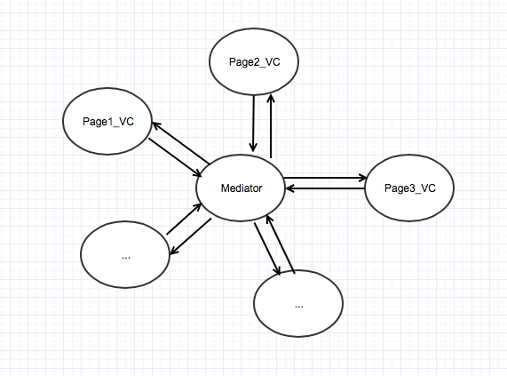
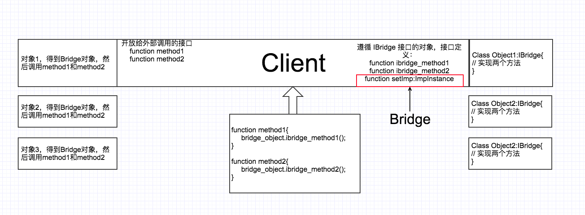

> Theme: 待定 
> Source Code Read Plan:
- [ ] [AppLord](https://github.com/NianJi/AppLord)
- [ ] [JLRoute](https://github.com/joeldev/JLRoutes)
- [ ] Block
> Reference Book List:  
- [ ] 《THE INNOVATORS》Doing
- [x] 《Curious git》
- [ ] 《Git教程（廖雪峰）》

# 2018/05/01
[我是一个“栈”](https://www.itcodemonkey.com/article/3033.html)

数据结构入门新手文，阐述数组、链表、队列和栈的概念，主要用比喻拟人的手法描述，对于入门文章来说非常不错，但对于想深入理解的依旧从“枯燥”的理论学习。

# 2018/05/03
[冰霜的iOS 组件化 —— 路由设计思路分析](https://www.jianshu.com/p/76da56b3bd55) 是一篇不错的入门文章，由web端的路由对照iOS端的路由表，然后介绍了`JLRoutes`、`routable-ios`、`HHRouter `、`MGJRouter`以及`CTMediator`，实现方式大同小异，总之值得反复阅读。

> 关于何为路由，作为一个初学者，我理解的是应用程序处于某个页面（VC控制器）时，页面上会绑定各种跳转行为（简单有模态弹出、navigation的push入栈等），举个简单的例子：点击按钮弹出一个详情页面，我们会先实例化一个详情页面的VC，然后调用`self.present`方法，此时当前视图控制器文件要`#import`详情页面的VC头文件。

我觉得上述所有这些都是为了**解决问题**而应运而生，那么从做一个需求开始讲起：

### 1.接手一个新需求
当需求给定时，页面的跳转行为十有八九就决定了，比如这个按钮跳转到页面1，另外一个控件触发跳转页面2，and so on。所以这个视图控制器要`#import`所有跳转的视图控制器类的头文件。

**问题1：** 页面的跳转行为硬编码，能否在当前页面跳转任意视图页面？

**答1:**  正如上面所说的，需求决定时，页面上的跳转行为实际已经决定，但是有一天后台说某个按钮的跳转页面由他回传字段决定，比如传过来字段是”KLine“，那么就跳转到K线页面，如果传过来字段是”Fenshi“，那么就跳转到分时页面，如果.... 此时你就会`switch-case`实现一个简单的映射表。但是想跳转到任意视图的页面... 似乎你的 `switch-case` 会撑爆你VC。

**问题2：** 当前VC关联了太多VC类的头文件，维护太吃力。

**答2：** 从正常使用来说无可厚非，解决方法可以借助 runtime 的反射，因为应用程序一开始就加载了所有类对象和元类对象，我们可以调用 `NSClassFromString()`来得到 Class，然后调用 `alloc init` 方法实例化一个`UIViewController`返回，这样我们的VC就不需要`#import`所有的关联类，解耦完毕！但是整个VC充斥的 runtime 的气息真的好吗？

### 2.中间者
为了代码友好，我们希望把所有实例化视图控制器的代码都移到一个类中：

```objective-c
//Mediator.m 文件
#import "Page1_VC.h"
#import "Page2_VC.h"

@implementation Mediator
// 页面1实例化行为
+ (UIViewController *)Page1_VC:(NSString *)param{
 return [Page1_VC viewController:param];
}

// 页面2实例化行为
+ (UIViewController *)Page2_VC:(NSString *)param1 param2:(NSInteger)param2 {
 return [Page2_VC viewController:param1 param2:param2];
}
@end
```

如果当前页面想要跳转到其他页面，调用如下，先导入`#import "Mediator.h"`

```objective-c
// 想要在 Page3_VC 中跳转，先导入中间者
#import "Mediator.h"
#import "Page3_VC.h" // 当前视图控制器的头文件

@implementation Page3_VC
- (void)gotoPage1  {
  // 获取参数 在下面注入
  // ...
  // 跳转
 UIViewController *page1 = [Mediator Page1_VC:params];
 [self.navigationController pushViewController:page1];
}

- (void)gotoPage2 {
  // 获取参数 在下面注入
  // ...
  // 跳转
  UIViewController *page2 = [Mediator Page2_VC:param1 param2:param2];
  [self.navigationController pushViewController:page2];
}
@end
```
现在问题在于 Mediator.h 依赖了所有视图控制器头文件。而每个视图控制器又导入了`#import "Mediator.h"`，依赖关系如下：



随着映射越来越多，中间件会难以维护，所以我们开始借助runtime来实例化对象，只需要知道类名就可以：

```objective-c
//Mediator.m 文件
#import "Mediator.h"

@implementation Mediator
// 页面1实例化行为
+ (UIViewController *)Page1_VC:(NSString *)param{
  Class cls = NSClassFromString(@"Page1_VC");
  return [cls performSelector:NSSelectorFromString(@"viewController:") withObject:@{@"param":param}];
}

// 页面2实例化行为
+ (UIViewController *)Page2_VC:(NSString *)param1 param2:(NSInteger)param2 {
  Class cls = NSClassFromString(@"Page2_VC");
  return [cls performSelector:NSSelectorFromString(@"viewController:") withObject:@{@"param":param,@"param2":param2}];
}
@end
```
类对象 `performSelector`，runtime 底层就是给类对象发送 `viewController` 消息，类对象会先取 isa 指针得到元类对象，然后在元类对象中找类方法`viewController`。

> 这里有个问题：参数传递！`performSelector` 的局限性，所以借助了字典。

此时 `Mediator.h` 对象就可以删掉所有`#import xxVC.h` 了，轻松。


### 3.其他方案
大部分的Route方案都是借助了runtime的进行解耦，如果把 runtime 也看做一个中间对象，那么依赖链如下： 

```
Page1_VC  ┐
Page2_VC  ┤
Page3_VC  ┤--> Mediator -> Runtime
...       ┤ 
PageN_VC  ┘
```

所有VC依赖 Mediator， 而 Mediator 依赖Runtime，整一个单项依赖。之后的优化这套方案，可以参考 casa 的做法，借助 category 来业务分类，避免集中把调用接口写在 Mediator.m 一个文件中，后面还是借助`target-action 简化写法`。

而蘑菇街的做法采用注册表的方式，Key=URL，Value=处理闭包，比如在闭包中实现实例化一个VC，然后返回`UIViewController *`，调用呢就是使用`open:withParams`方法

```objective-c
//Mediator.m 中间件
@implementation Mediator
typedef void (^componentBlock) (id param);
@property (nonatomic, storng) NSMutableDictionary *cache
- (void)registerURLPattern:(NSString *)urlPattern toHandler:(componentBlock)blk {
 [cache setObject:blk forKey:urlPattern];
}

- (void)openURL:(NSString *)url withParam:(id)param {
 componentBlock blk = [cache objectForKey:url];
 if (blk) blk(param);
}
@end
```

引出问题：难道我们要集中在Mediator文件中对每个组件都进行`register`？那么势必要导入所有依赖VC的头文件。所以这样不行。

那么我们规定每个组件必须统一要有一个 `+initComponent` 类方法进行组件注册不就ok了吗，问题是谁来 call 这个方法？估摸就是搞一份配置文件，然后在`didFinishLaunch`方法中读取了组件类信息，然后还是调用runtime进行注册。

关于蘑菇街的`protocol-class`还没有看。另外关于大神们一直诟病于蘑菇街的本地调用和远程调用混用，也暂时不太理解。

#2018/05/06
[A curious tale](https://matthew-brett.github.io/curious-git/curious_journey.html)

git 实现原理比喻版本，通俗易懂。其实从大学写论文我们就已经在接触版本管理了。XX论文初稿->XX论文修订版->XX论文完整版->XX论文终极版->XX论文终极无敌版...

文章分为了11小节，主要讲述了 `workspace`工作区、为什么要有`commit`、`checkout`该命令的设计目的、为何要引入 `stage` 区等方面。

### Gitwards 1: make regular snapshots
未引入版本管理之前，我们就在一份work上进行修改，添加，删除等操作，但这些都是不可逆的，一旦发现之前的才是正确的，需要我们回想然后再次修改。因此一旦我们认为此次修改是一次里程碑，那么就会把工作目录下的文件移动到另外一个文件夹，命名成 snapshotX。ps：其实应该大部分写过论文都会这么干过吧。

### Gitwards 2: reminding yourself of what you did
为了记起每次提交的信息，我们会添加一个 `message.txt` 文件记录提交者、日期以及描述

### Gitwards 3: breaking up work into chunks
由于每个人的工作习惯不同，导致有些人喜欢一次性在工作区进行多个不同方面的改动，然后作为一次提交命名成一个snapshot，如果我们想要分功能依次提交，该怎么做？

这时候就要引入 staging 区，它其实就是作为每次提交的内容文件夹，我们一旦认为工作区的修改可以作为下一次提交，就把它们add到staging区，一旦提交，staging区就打包成一个新的snapshot。

### Gitwards 4: getting files from previous commits
从之前版本中获取文件，即 checkout 操作，一旦检出某个文件，就是把那个snapshot中的文件替换掉工作区的相同文件，此时肯定有改动，但是你想要提交，那么按照add到stage区后commit下就ok了。

### Gitwards 5: two people working at the same time
阐述 git branch 和 git merge 的操作

### Gitwards 6: how should you name your commit directories
但是在多人合作的情况下回出现命名文件，所以我们寻求一个唯一identifier，即hash操作，easy get hard reverse。此时只是用hash值重命名snapshotN文件夹以及文件内的message.txt文件，至于其他的都未改动

### Gitwards 7: naming commits from hashes
现在所有的snapshot都以hash命名，导致从阅读性上不太人性化，首当其冲就是我们无法得知提交的顺序，之前还可以从文件命名获取序号1、2、3...

为此我们在message.txt中新记录 parent field，即上一次的提交hash，如果是merge则会是两个。

### Gitwards 8: the development history is a graph
### Gitwards 9: saving space with file hashes
### Gitwards 10: making the commits unique
### Gitwards 11: away with the snapshot directories
8-11总结：以上面的方式进行版本管理，内存问题是我们需要优化，毕竟每次都会重新copy一份，迟早会爆掉。
注意到其实每次提交我们并非修改全部文件，有些文件压根都没动过，但是它们还是会被重新copy多次。

为此我们会新建一个 repo 目录，每个文件就是一个object存在，计算它的hash值，然后以hash值命名放到repo下，如果这个文件修改过，那么重新计算hash，此时作为一个新的object（命名自然也是新hash）放到repo目录下，这么做的好处在于减少无谓的内存开销。

至于我们怎么知道某次snapshot中囊括的文件版本，我们可以新加一个directory.txt文件，里面记录此次提交的文件名称对应的hash，这样每次恢复的时候就会从repo下去拿了，而message中我们新加一条 directory: directory.txt的hash记录。

## 2018/05/08
[git-from-the-inside-out](https://codewords.recurse.com/issues/two/git-from-the-inside-out)，配合[A curious tale](https://matthew-brett.github.io/curious-git/curious_journey.html)简直就是神作。

补了下 git 基础知识

## 2018/05/09
关于Bridge桥接模式、Adapter适配器模式和Facade外观模式的简单理解：

> 接口是现有设计好的，只能用**适配器模式**去包裹源接口，开放适配接口调用; 而桥接模式是在一切都未设计之前，将抽象和实现分离，这样讲其实很抽象。



上面是桥接模式的一种展示，中间的“Bridge”就是桥，两端（输入输出）都用接口定义，所以它是抽象的，输入端必须传入一个具体实现IBridge的对象，在内部调用其方法，而开放的接口时钟是 method1和method2。

> 这座桥的两端内容是可以更换的，比如左边可以更换成对象2，右边是Object2具体实现类。记住右侧是输入端，传入一个遵循接口的具体实现对象，“桥”所要干的事情就是调用输入对象的接口方法；左侧会输出端，会开辟接口供外部调用，而这些接口通常会间接调用传入的具体实现对象的方法。

Demo:
```Objective-c
/** "Implementor" */
interface DrawingAPI {
    public void drawCircle(final double x, final double y, final double radius);
}

/** "ConcreteImplementor"  1/2 */
class DrawingAPI1 implements DrawingAPI {
    public void drawCircle(final double x, final double y, final double radius) {
        System.out.printf("API1.circle at %f:%f radius %f\n", x, y, radius);
    }
}

/** "ConcreteImplementor" 2/2 */
class DrawingAPI2 implements DrawingAPI {
    public void drawCircle(final double x, final double y, final double radius) {
        System.out.printf("API2.circle at %f:%f radius %f\n", x, y, radius);
    }
}

/** "Abstraction" */
abstract class Shape {
    protected DrawingAPI drawingAPI;

    protected Shape(final DrawingAPI drawingAPI){
        this.drawingAPI = drawingAPI;
    }

    public abstract void draw();                                 // low-level
    public abstract void resizeByPercentage(final double pct);   // high-level
}

/** "Refined Abstraction" */
class CircleShape extends Shape {
    private double x, y, radius;
    public CircleShape(final double x, final double y, final double radius, final DrawingAPI drawingAPI) {
        super(drawingAPI);
        this.x = x;  this.y = y;  this.radius = radius;
    }

    // low-level i.e. Implementation specific
    public void draw() {
        drawingAPI.drawCircle(x, y, radius);
    }
    // high-level i.e. Abstraction specific
    public void resizeByPercentage(final double pct) {
        radius *= (1.0 + pct/100.0);
    }
}

/** "Client" */
class BridgePattern {
    public static void main(final String[] args) {
        Shape[] shapes = new Shape[] {
            new CircleShape(1, 2, 3, new DrawingAPI1()),
            new CircleShape(5, 7, 11, new DrawingAPI2())
        };

        for (Shape shape : shapes) {
            shape.resizeByPercentage(2.5);
            shape.draw();
        }
    }
}
```

这里`CircleShape`就是一个**桥**，传入的是遵循接口 `DrawingAPI` 的对象，开辟了 `draw` 和 `resizeByPercentage` 方法供外部使用，而其中`draw`又间接调用传入对象的 drawCircle 方法。

而 `class BridgePattern` 的main方法中就是在调用桥 `Shape` 开放的接口`resizeByPercentage` 和 `draw` 方法

> 这么看来，上面说的抽象和具体实现分离就很清楚了。

而外观模式不过是二次封装接口，使得 API 接口更加友好罢了。
