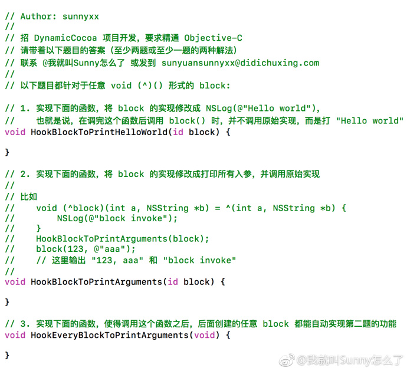
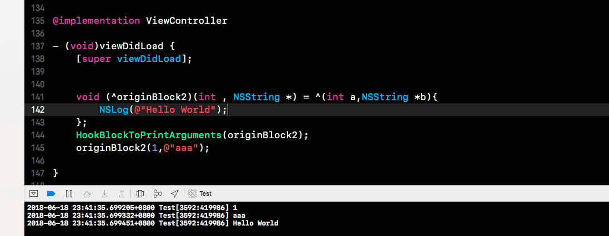

> Theme: 待定 
> Source Code Read Plan:
- [ ] [RunLoop 源码]()
- [ ] [JLRoute](https://github.com/joeldev/JLRoutes)
- [ ] Block
> Reference Book List:
- [ ] 《Git教程（廖雪峰）》

# 2018/06/13
* [InjectionIII](https://github.com/johnno1962/InjectionIII) iOS 代码注入工具
* [injectionforxcode](https://github.com/johnno1962/injectionforxcode) Xcode 代码注入插件

John Holdsworth 一位56岁，20多年开发经验的牛人！

关于实现原理，简单看了下老峰的 [Injection：iOS热重载背后的黑魔法](https://mp.weixin.qq.com/s/hFnHdOP6pmIwzZck-zXE8g)，对于完整的实现并没有一个系统的了解，之后补上。

# 2018/06/14(LLDB 调试相关)
objc 的[与调试器共舞 - LLDB 的华尔兹](https://www.objccn.io/issue-19-2/)，讲述了如何在 xcode 命令行调试工程，尤其是最后几个实战的例子，我认为是入门的佳作，简单总结下：
1. 常用的像 `print(p)`，`expression(e)` ， 小知识：`print` 实际上是 `expression --` 的缩写；输出格式也可以指定二进制，八进制，十进制或者十六进制或字符，分别对应`p/t`，`p/o`，`p`，`p/x`，`p/c`；
2. `continue，step over，step into，step out`流程控制，简写分别对应 `c`，`n`，`s`，`finish`，小知识：如果一个函数要提前退出，且返回一个值，可以用 `thread return xx`，实时上对于 `c，n，s` 都是 `thread` 命令的缩写； 
3. 关于断点，breakpoint 缩写 br，支持显示断点列表(br li)，断点开启和关闭(br enable，br disable)，断点删除(br delete)等等，个人觉得还是可视化界面直接鼠标点击来的方便
4. 我们知道可以命令行修改视图背景色，宽高等等，但是如何立即生效呢？用 `e (void)[CATransaction flush]` 刷新一次UI； ，不着急记命令，因为后面说到python可以封装一个，然后简写命名；
5. 命令行创建一个视图控制器，然后push or present 它，知识点：所以命令行声明一个变量都是以 `$` 打头的，比如 `int $a = 20`，之后用也是 `$a` 来访问值，指针注意是星号在前，简单来说就是 `$` 总是紧贴变量，例如`int *$a`
6. 观察实例变量比较少用，场景是我们想要只是这个实例变量什么时候被修改，那么我们就要用 `watchpoint set expression -- instanceVarAddress`，关键是怎么计算这个实例变量的地址，我们用实例地址+偏移量得到，偏移量要用runtime的`ivar_getOffset()` 和 `(struct Ivar *)class_getInstanceVariable([MyView class], "_layer")` 
7. 最有意思的是自己在已有的命令上封装，比如刷新页面 `e (void)[CATransaction flush]` 或 push 一个视图，毕竟我们不能每次都手输一长串的代码，我们希望将一系列操作封装成类似函数的东西，然后调用，所以这里要用到 lldb和 python 如何结合实现

看了下官方文档 [LLDB Python Reference](http://lldb.llvm.org/python-reference.html)，大致也了解了用法：

方式一，直接在命令行输入 `script` 先进入 python 的 REPL(Read–eval–print loop)模式：

```
(lldb) script
// 注意 `ModifyString` 是程序中的全局函数
>>> def pofoo_funct(debugger, command, result, internal_dict):
...	cmd = "po [ModifyString(" + command + ") capitalizedString]"
...	lldb.debugger.HandleCommand(cmd)
... 
>>> exit()
(lldb) command script add pofoo -f pofoo_funct 
(lldb) pofoo aString
$1 = 0x000000010010aa00 Hello Worldfoobar
(lldb) pofoo anotherString
$2 = 0x000000010010aba0 Let's Be Friendsfoobar
```

注意`command script add 别名 -f 函数名`，-f 我猜测是function的标识，现在直接可以在Xcode命令终端中输入 pofoo 来愉快的玩耍了

方式二，将命令封装成一个 Module，然后调用 `command script import` 导入，以下是官方提供的例子：

```
#!/usr/bin/python

import lldb
import commands
import optparse
import shlex

def ls(debugger, command, result, internal_dict):
    print >>result, (commands.getoutput('/bin/ls %s' % command))

# And the initialization code to add your commands 
def __lldb_init_module(debugger, internal_dict):
    // 这个函数是官方说第一次加载时候回自动执行
    // 接着就是熟悉的添加命令了，函数定义在上面，ls.ls 是 “文件名.函数名” 命名
    debugger.HandleCommand('command script add -f ls.ls ls')
    print 'The "ls" python command has been installed and is ready for use.'
```

其他方式，如 facebook 的 Chisel 库同样也是以约定好的方式用python对已有命令进行封装，比如 pviews 就是输出整个视图层级。安装这个库相当简单，用brew或者手动下载源文件，然后在用户目录(`~`)下的 `.lldbinit ` 文件写入：

```
command script import /path/to/fblldb.py 
```

没有这个文件也没啥，自己 `touch .lldbinit` 一个然后编译下，写入内容其实很熟悉，就是导入 dblldb.py 这个Module，我们可以看下这个文件的 `__lldb_init_module` 函数：

```
def __lldb_init_module(debugger, dict):
  // 1
  filePath = os.path.realpath(__file__)
  lldbHelperDir = os.path.dirname(filePath)

  commandsDirectory = os.path.join(lldbHelperDir, 'commands')
  // 2
  loadCommandsInDirectory(commandsDirectory)
```

第一步是获取 `dblldb.py` 文件所在地址，然后这个文件目录下有个 `commands` 目录，包含了所有自定义 python 脚本，用 `loadCommandsInDirectory` 加载：

```
def loadCommandsInDirectory(commandsDirectory):
  // 1
  for file in os.listdir(commandsDirectory):
    // 2
    fileName, fileExtension = os.path.splitext(file)
    if fileExtension == '.py':
      // 3
      module = imp.load_source(fileName, os.path.join(commandsDirectory, file))
  
      // 4
      if hasattr(module, 'lldbinit'):
        module.lldbinit()
      
      // 5
      if hasattr(module, 'lldbcommands'):
        module._loadedFunctions = {}
        // 6
        for command in module.lldbcommands():
          loadCommand(module, command, commandsDirectory, fileName, fileExtension)
```

1. 遍历commands 目录下的所有文件；
2. 获取文件名和扩展名，这里只处理 `.py` 脚本
3. 这里导入了 imp 模块，个人认为有点类似runtime机制，可以 `[xx performSelector:]`，而不需要在文件头部导入依赖(`import 某个python脚本名称`)，
4. 判断是否能响应 `lldbinit()` 方法，能则调用；
5. 同理，`module._loadedFunctions` 返回了这个模块下所有的命令
6. 使用 loadCommand 加载，具体实现见下：

```
def loadCommand(module, command, directory, filename, extension):
  func = makeRunCommand(command, os.path.join(directory, filename + extension))
  name = command.name()
  helpText = command.description().strip().splitlines()[0] # first line of description

  key = filename + '_' + name

  module._loadedFunctions[key] = func

  functionName = '__' + key

  // 1
  lldb.debugger.HandleCommand('script ' + functionName + ' = sys.modules[\'' + module.__name__ + '\']._loadedFunctions[\'' + key + '\']')
  // 2
  lldb.debugger.HandleCommand('command script add --help "{help}" --function {function} {name}'.format(
    help=helpText.replace('"', '\\"'), # escape quotes
    function=functionName,
    name=name))
```

上面函数简单理解就是先拼接出一串能在终端执行的命令，接着调用`lldb.debugger.HandleCommand` load 命令到 lldb.debugger，关于代码 2 `command script add --help` 就是把命令添加进来，同时还给出了帮助说明。但是代码 1 输出命令为：

```
script __FBTextInputCommands_settext = sys.modules['FBTextInputCommands']._loadedFunctions['FBTextInputCommands_settext']
script __FBTextInputCommands_setinput = sys.modules['FBTextInputCommands']._loadedFunctions['FBTextInputCommands_setinput']
script __FBDebugCommands_wivar = sys.modules['FBDebugCommands']._loadedFunctions['FBDebugCommands_wivar']
...
```

> sys.modules是一个全局字典，该字典是python启动后就加载在内存中。每当程序员导入新的模块，sys.modules都将记录这些模块。字典sys.modules对于加载模块起到了缓冲的作用。当某个模块第一次导入，字典sys.modules将自动记录该模块。当第二次再导入该模块时，python会直接到字典中查找，从而加快了程序运行的速度。

# 2018/06/15
关于 sunnyxx 出的面试题：



针对第一题，只是替换 Block 的实现为输出 “Hello world”，其实第一反应是替换掉Block内的函数指针就行，但是必须先由一定Block基础知识，知道它的数据结构：

```objective-c
typedef struct _PT_Block {
    __unused Class isa;
    volatile int flags; // contains ref count
    __unused int reserved;
    void (*invoke)(void *, ...); // 这个就是要替换的函数指针
    struct {
        unsigned long int reserved;
        unsigned long int size;
        void (*copy)(void *dst, const void *src);
        void (*dispose)(const void *);
        const char *signature;
        const char *layout;
    } *descriptor;
} *PTBlockRef;
```

然后在 `HookBlockToPrintHelloWorld` 将 Block 中的 invoke 函数指针指向我们的 `printHelloWorld`。

```objective-c
void printHelloWorld(){
    printf("Hello World");
}

void HookBlockToPrintHelloWorld(id block) {
    PTBlockRef layout = (__bridge void *)block;
    void (*hookedFunc)(void *,...) = printHelloWorld;
    layout->invoke = hookedFunc;
}
```

第二题，思路应该是在 `HookBlockToPrintArguments` 同样替换掉实现，然后新的实现会输出参数和再次执行闭包，我一开始是想通过获得第一个入参的栈上地址，然后取偏移量，结果发现貌似和我想的有出路，没法实现。。。。贴下代码：

```objective-c
NSMethodSignature *methodSignature = nil;
// Self 是闭包自己
void printParams(void *Self, ...) {
    
    NSInteger count = methodSignature.numberOfArguments;
    void *ap = ((void *)&Self) + sizeof(Self);
    
    // 遍历block的参数列表 第一个是Self 指向 Block 本身
    for (int index = 1; index < count; index++) {
        const char *argType = [methodSignature getArgumentTypeAtIndex:index];
        int offset = 0;

        if (strcmp(argType, @encode(id)) == 0 || strcmp(argType, @encode(Class)) == 0) {
            NSLog(@"%@",(__bridge id)ap);
            offset = sizeof(id);
        } else if (strcmp(argType, @encode(char)) == 0) {
            NSLog(@"%c",*(char *)ap);
            offset = sizeof(id);
        } else if (strcmp(argType, @encode(int)) == 0) {
            NSLog(@"%d",*(int *)ap);
            offset = sizeof(int);
        } else if (strcmp(argType, @encode(short)) == 0) {
            NSLog(@"%d",*(short *)ap);
            offset = sizeof(short);
        } else if (strcmp(argType, @encode(long)) == 0) {
            NSLog(@"%ld",*(long *)ap);
            offset = sizeof(long);
        } else if (strcmp(argType, @encode(float)) == 0) {
            NSLog(@"%f",*(float *)ap);
            offset = sizeof(float);
        } else if (strcmp(argType, @encode(double)) == 0) {
            NSLog(@"%f",*(double *)ap);
            offset = sizeof(double);
        } else if (strcmp(argType, @encode(BOOL)) == 0) {
            NSLog(@"%d",*(BOOL *)ap);
            offset = sizeof(BOOL);
        } else if (strcmp(argType, @encode(char *)) == 0) {
            NSLog(@"%s",*(char **)ap);
            offset = sizeof(char *);
        }
        ap += offset;
    }
}

void HookBlockToPrintArguments(id block) {
    PTBlockRef layout = (__bridge void *)block;
    void (*hookedFunc)(void *,...) = (void (*)(void *, ...))printParams;

    // 为了获取block参数类型
    const char *_Block_signature(void *);
    const char *signature = _Block_signature((__bridge void *)block);
    
    methodSignature = [NSMethodSignature signatureWithObjCTypes:signature];
    
    layout->invoke = hookedFunc;
}

```

后面我借助c语言的 va_list 试着修改了下 `printParams` 函数：
```

NSMethodSignature *methodSignature = nil;
void (*g_invoke)(void *, ...) = nil;
// Self 是闭包自己
void printParams(void *Self, ...) {
    
    NSInteger count = methodSignature.numberOfArguments;
    void *ap = ((void *)&Self) + sizeof(Self);
    va_list va;
    va_start(va, Self);
    
    // 遍历block的参数列表 第一个是Self 指向 Block 本身
    for (int index = 1; index < count; index++) {
        const char *argType = [methodSignature getArgumentTypeAtIndex:index];
        int offset = 0;

        if (strcmp(argType, @encode(id)) == 0 || strcmp(argType, @encode(Class)) == 0) {
            void *args = va_arg(va, void *);
            NSLog(@"%@",args);
        } else if (argType[0] == '@') {
            void *args = va_arg(va, void *);
            NSLog(@"%@",args);
        } else if (strcmp(argType, @encode(char)) == 0) {
            char args = va_arg(va, char);
            NSLog(@"%c",args);
        } else if (strcmp(argType, @encode(int)) == 0) {
            int args = va_arg(va, int);
            NSLog(@"%d",args);
        } else if (strcmp(argType, @encode(short)) == 0) {
            short args = va_arg(va, short);
            NSLog(@"%d",args);
        } else if (strcmp(argType, @encode(long)) == 0) {
            long args = va_arg(va, long);
            NSLog(@"%d",args);
        } else if (strcmp(argType, @encode(float)) == 0) {
            float args = va_arg(va, float);
            NSLog(@"%f",args);
        } else if (strcmp(argType, @encode(double)) == 0) {
            double args = va_arg(va, double);
            NSLog(@"%f",args);
        } else if (strcmp(argType, @encode(BOOL)) == 0) {
            BOOL args = va_arg(va, BOOL);
            NSLog(@"%d",args);
        } else if (strcmp(argType, @encode(char *)) == 0) {
            char *args = va_arg(va, char *);
            NSLog(@"%x",args);
        }
        ap += offset;
    }
    
    va_end(va);
    
    g_invoke(Self);
}

void HookBlockToPrintHelloWorld(id block) {
    PTBlockRef layout = (__bridge void *)block;
    void (*hookedFunc)(void *,...) = printParams;

    layout->invoke = hookedFunc;
}


void HookBlockToPrintArguments(id block) {
    PTBlockRef layout = (__bridge void *)block;
    void (*hookedFunc)(void *,...) = (void (*)(void *, ...))printParams;

    // 为了获取block参数类型
    const char *_Block_signature(void *);
    const char *signature = _Block_signature((__bridge void *)block);
    
    methodSignature = [NSMethodSignature signatureWithObjCTypes:signature];
    g_invoke = layout->invoke;
    layout->invoke = hookedFunc;
}

- (void)viewDidLoad {
    [super viewDidLoad];
    
    
    void (^originBlock2)(int , NSString *) = ^(int a,NSString *b){
        NSLog(@"Hello World");
    };
    HookBlockToPrintArguments(originBlock2);
    originBlock2(1,@"aaa");

}
```

输出：



这样就可以正常输出闭包参数了，但是感觉哪里怪怪的。

# 2018/06/19
上面代码中 `_Block_signature` 实际上runtime中是 export 出来的方法，但是因为是 `_block_private.h`，意味着是私有的API，但是又因为它是全局export，所以你只要先声明就可以调用了，获取block的签名
```objective-c
const char *_Block_signature(void *);
const char *signature = _Block_signature((__bridge void *)block);
```

如果不能用私有API，我们可以用如下方式实现，即用 block 结构体中的 signature 参照 Aspect 的源码取block的签名（其实就是获取结构体中的 descriptor）：

```
static NSMethodSignature *aspect_blockMethodSignature(id block, NSError **error) {
    AspectBlockRef layout = (__bridge void *)block;
	if (!(layout->flags & AspectBlockFlagsHasSignature)) {
        NSString *description = [NSString stringWithFormat:@"The block %@ doesn't contain a type signature.", block];
        AspectError(AspectErrorMissingBlockSignature, description);
        return nil;
    }
	void *desc = layout->descriptor;
	desc += 2 * sizeof(unsigned long int);
	if (layout->flags & AspectBlockFlagsHasCopyDisposeHelpers) {
		desc += 2 * sizeof(void *);
    }
	if (!desc) {
        NSString *description = [NSString stringWithFormat:@"The block %@ doesn't has a type signature.", block];
        AspectError(AspectErrorMissingBlockSignature, description);
        return nil;
    }
	const char *signature = (*(const char **)desc);
	return [NSMethodSignature signatureWithObjCTypes:signature];
}

static id invokeBlock(id block ,NSArray *arguments) {
    if (block == nil) return nil;
    id target = [block copy];
    
    NSMethodSignature *methodSignature =aspect_blockMethodSignature(block,nil);
    NSInvocation *invocation = [NSInvocation invocationWithMethodSignature:methodSignature];
    invocation.target = target;
    
    // invocation 有1个隐藏参数，所以 argument 从1开始
    if ([arguments isKindOfClass:[NSArray class]]) {
        NSInteger count = MIN(arguments.count, methodSignature.numberOfArguments - 1);
        for (int i = 0; i < count; i++) {
            const char *type = [methodSignature getArgumentTypeAtIndex:1 + i];
            NSString *typeStr = [NSString stringWithUTF8String:type];
            if ([typeStr containsString:@"\""]) { 
                type = [typeStr substringToIndex:1].UTF8String;
            }
            
            // 需要做参数类型判断然后解析成对应类型，这里默认所有参数均为OC对象
            if (strcmp(type, "@") == 0) {
                id argument = arguments[i];
                [invocation setArgument:&argument atIndex:1 + i];
            }
        }
    }
    
    [invocation invoke];
    
    id returnVal;
    const char *type = methodSignature.methodReturnType;
    NSString *returnType = [NSString stringWithUTF8String:type];
    if ([returnType containsString:@"\""]) {
        type = [returnType substringToIndex:1].UTF8String;
    }
    if (strcmp(type, "@") == 0) {
        [invocation getReturnValue:&returnVal];
    }
    // 需要做返回类型判断。比如返回值为常量需要包装成对象，这里仅以最简单的`@`为例
    return returnVal;
}
```

上面遇到了 signature 返回的描述，如果是 NSString *，返回的是 "@\NSString\". 

invocation.target 设成了闭包，我猜测内部会判断target类型，如果是闭包，就执行调用里面的函数指针，然后传入参数值，至于怎么变参注入比较疑惑。

# 2018/06/20

完善 [RunLoop源码解析](https://github.com/colourful987/2018-Read-Record/blob/master/Content/iOS/RunLoop/RunLoop源码解析.md) 一文