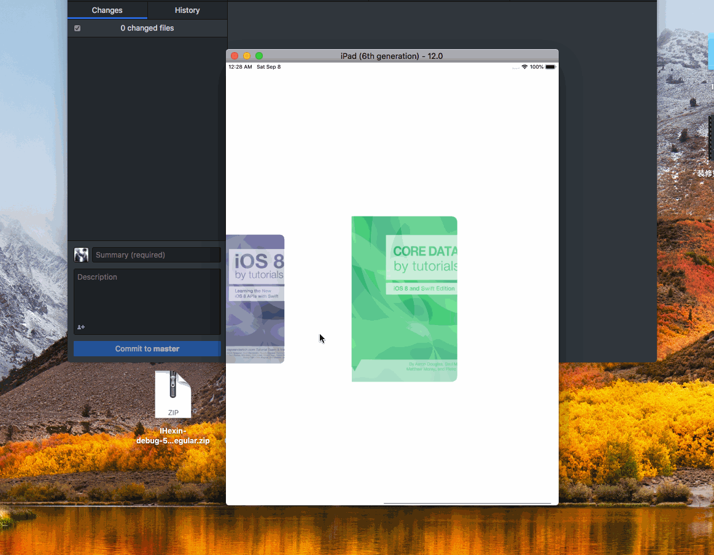

> Theme: Computer underlying knowledge 
> Source Code Read Plan:
> - [ ] GCD 底层libdispatch
> - [ ] TableView Reload 原理，博文总结
> - [x] Custom UIViewController Transitions (随便写几个demo实现玩)

# 2018/09/03

[可交互式的滑入滑出效果](https://github.com/colourful987/2018-Read-Record/tree/master/Content/iOS/TransitionWorld/TransitionWorld/Transition%20Demo/Demo3)

效果如下：


核心系统方法：

```oc
// UIPercentDrivenInteractiveTransition 三个核心方法
[self updateInteractiveTransition:progress]

[self cancelInteractiveTransition]

[self finishInteractiveTransition]
```

然后在代理方法中返回这个 InteractionController 对象即可

```
- (id<UIViewControllerInteractiveTransitioning>)interactionControllerForDismissal:(id<UIViewControllerAnimatedTransitioning>)animator {
    if (self.slideInteractionController.interactionInProgress) {
        return self.slideInteractionController;
    }
    
    return nil;
}
```

> 总结：转场动画为了可复用性，定义了太多的协议，因此一定要搞清楚各自的职责。
> 从层级最高的来讲是 `UIViewControllerTransitioningDelegate` ，也就是我们经常设置的`delegate`，它从大方向上指明了我们应该可选的不同职责的对象：

1. 转场显示的动画对象(`animationControllerForPresentedController`)；
2. 转场消失的动画对象(`animationControllerForDismissedController`)；
3. 可交互的动画显示对象(`interactionControllerForPresentation`)；
4. 可交互的动画消息对象(`interactionControllerForDismissal`)；
5. 呈现方式(`presentationControllerForPresentedViewController`);

> 如上所述每一个动画/可交互对象同样需要时遵循协议的，比如动画的需要`UIViewControllerAnimatedTransitioning`协议;可交互式对象为`UIViewControllerInteractiveTransitioning`协议；呈现的对象干脆就是一个封装好的基类`UIPresentationController`

码代码过程中，如果我们二次封装，我觉得动画对象应该持有一个可交互式的对象，但是要以依赖注入的方式！

遗留问题：
1. 当progress进度小于0.5放手时也执行了dismiss操作，这个是不合理的;
2. 实例化一个 InteractionController 的方式需要把手势加载到sourceViewController的view上，项目中过早的调用 viewController.view可能导致视图控制器LifeCycle生命周期错乱的可能性。


# 2018/09/05

[右上角圆形发散式转场，参照Raywenderlich](https://github.com/colourful987/2018-Read-Record/tree/master/Content/iOS/TransitionWorld/TransitionWorld/Transition%20Demo/Demo4)

效果如下：


# 2018/09/06
重要事情说三遍：
1. **只要设置**`destinationVC.transitioningDelegate = self`就可以了，如果没有实现自定义呈现类，**不要设置**`destinationVC.modalPresentationStyle = UIModalPresentationCustom`!!!
2. **只要设置**`destinationVC.transitioningDelegate = self`就可以了，如果没有实现自定义呈现类，**不要设置**`destinationVC.modalPresentationStyle = UIModalPresentationCustom`!!!
3. **只要设置**`destinationVC.transitioningDelegate = self`就可以了，如果没有实现自定义呈现类，**不要设置**`destinationVC.modalPresentationStyle = UIModalPresentationCustom`!!!

mmp的转成present的时候往 `transitionContext.containerView`(系统提供的`UITransitionView`) add子视图是没有问题的，但是dismiss的时候却“不正常”，动画正确地执行，然后黑屏！其实“不正常”是情理之中的事情，因为设置了 `destinationVC.modalPresentationStyle = UIModalPresentationCustom;`，系统会向delegate询问关于呈现（Presentation）由谁负责：

```oc
// 如下写法
- (UIPresentationController *)presentationControllerForPresentedViewController:(UIViewController *)presented presentingViewController:(UIViewController *)presenting sourceViewController:(UIViewController *)source {
    return [[DimmingPresentationController alloc] initWithPresentedViewController:presented presentingViewController:presenting];
}

// 附上DimmingPresentationController的实现

@interface DimmingPresentationController()
@property(nonatomic, strong)CHGradientView *dimmingView;
@end

@implementation DimmingPresentationController

- (void)presentationTransitionWillBegin {
    self.dimmingView.frame = self.containerView.bounds;
    [self.containerView insertSubview:self.dimmingView atIndex:0];
    self.dimmingView.alpha = 0;
    
    id <UIViewControllerTransitionCoordinator> transitionCoordinator =  self.presentedViewController.transitionCoordinator;
    
    if (transitionCoordinator) {
        [transitionCoordinator animateAlongsideTransition:^(id<UIViewControllerTransitionCoordinatorContext>  _Nonnull context) {
            self.dimmingView.alpha = 1;
        } completion:nil];
    }
}

- (void)dismissalTransitionWillBegin {
    id <UIViewControllerTransitionCoordinator> transitionCoordinator =  self.presentedViewController.transitionCoordinator;
    
    if (transitionCoordinator) {
        [transitionCoordinator animateAlongsideTransition:^(id<UIViewControllerTransitionCoordinatorContext>  _Nonnull context) {
            self.dimmingView.alpha = 0;
        } completion:nil];
    }
}

// 如果是半屏的话 这个属性设置为NO 表明不移除当前视图
- (BOOL)shouldRemovePresentersView {
    return NO;
}

- (CHGradientView *)dimmingView {
    if (!_dimmingView) {
        _dimmingView = [[CHGradientView alloc] initWithFrame:CGRectZero];
    }
    return _dimmingView;
}
@end
```

说一个视图是 `presentedViewController` 还是 `presentingViewController` ，是有个相对关系的，一定要说 A 是 B 的 `presentedViewController/presentingViewController`。

一个视图控制器即可以是`presentedViewController` 也可以是 `presentingViewController`，比如 A present B, B present C，那么 B 就扮演了两个角色，B是A的 presentedViewController，又是C的presentingViewController；
A 则简单点，是B的presentingViewController；C则只有一种角色，是B的presentedViewController。


# 2018/09/07

[Book 模仿书本翻页动画，参照Raywenderlich](https://github.com/colourful987/2018-Read-Record/tree/master/Content/iOS/BookTutorial)

效果如下：


    
之前作者的 demo 停留在 swift2.x版本，所以特地改写了下，然而没有用最新的swift语法，能跑就行。

整个例子重点是实现的思路，以及collectionView的使用技巧，真的很牛逼！

另外目前只是做了代码搬运工，表示毫无成就感，一没把collectionView运用的得心应手，二不了解这个翻页动画的实现，三... 趁着周末学习一波，起码要有收获，尽量不做代码搬运工，伪成就感还是不要有的好。


# 2018/09/08 - 2018/09/09
给Book animation tutorial工程增加了注释，从几何角度了解这个翻页动画的实现，难点还是`CATransform`的知识 目前搜了几篇文章，可以学习一波基础知识：

* [CGAffineTransform与CATransform3D](https://www.cnblogs.com/jingdizhiwa/p/5481072.html)
* [如何使用 CATransform3D 处理 3D 影像、制做互动立体旋转的效果 ?](http://www.myzaker.com/article/591d1d7a1bc8e04e43000002/)
* [iOS-从三维立方体到理解CATransform3D&CGAffineTransform&m34](https://www.jianshu.com/p/3dd14cfbdc53)

ps: 貌似大家都喜欢以三维矩形筛子来作为演示demo，撞车比较严重


# 2018/09/10

> 教师节快乐！撒花！

给Book animation tutorial 整个demo用swift4.2重写了，需要在Xcode10 iOS12.0下运行。其实这个教程刚出来时候就对着码了，当时说白了也是抄着玩（现在也差不多orz...)，感觉吃透这篇文章可以学习以下几块知识点：
1. collectionView 自定义布局如何实现书本展开、转盘等效果，这里涉及重写 collectionView 的 `layoutAttributesForElements` 等一系列方法，难度2/5星吧；
2. transform 三维上的仿射变换，这个涉及数学几何知识，难度3/5；
3. 转场动画，由于之前已经“瞎搞过一阵子”，所以感觉难度在1/5星；

# 2018/09/11
本周会研究下 tableview 的 reload 操作实现，可以参照的源码 [Chameleon](https://github.com/BigZaphod/Chameleon)，Chameleon is a port of Apple's UIKit (and some minimal related frameworks) to Mac OS X. 说白了就是从iOS移植到Mac端的代码，尽管最后一次提交代码还停留在4 years ago，但是参考价值很足。

其次还涉及到 Runloop，毕竟我们操作的东西都是由runloop对象管理的，大部分其实是procedure过程式，处理流程就摆在那里，源码我看的是 github 上的 apple repo：[swift-corelibs-foundation](https://github.com/apple/swift-corelibs-foundation)。

实际开发中经常会用到 GCD 配合 reloadData  对 TableView  刷新，所以对 GCD 底层实现原理还需要了解，源码应该会看libdispatch。

最后还是站在前人肩膀上，看了下[iOS 事件处理机制与图像渲染过程](http://www.cnblogs.com/yulang314/p/5091894.html)，差不多算16年的博文了，具有参考价值，本文的reference还涉及了如下文章：

* runloop原理 (https://github.com/ming1016/study/wiki/CFRunLoop)
* 深入理解runloop (http://blog.ibireme.com/2015/05/18/runloop/)
* 线程安全类的设计 (http://objccn.io/issue-2-4/)
* iOS保持界面流畅的技巧和AsyncDisplay介绍 （http://blog.ibireme.com/2015/11/12/smooth_user_interfaces_for_ios/）
* 离屏渲染 (http://foggry.com/blog/2015/05/06/chi-ping-xuan-ran-xue-xi-bi-ji/)
* ios核心动画高级技巧 (https://zsisme.gitbooks.io/ios-/content/index.html)


# 2018/09/11 
今天查了一个UIWebview加载网页资源慢的问题，涉及NSURLCache缓存策略，由于之前都不怎么涉及Web相关的业务，所以排查这个问题对于我这个小白来说有些许挑战，一开始比较心虚，像个无头苍蝇没有切入点，在经过一系列 Charles 抓包，调试 UIWebview 、NSURLCache 相关源码，渐渐找到一些眉目，不过根本原因还是未解决，现简单记录下采坑记录，引以为鉴：

1. 关于Charles如何抓包，网上搜关键字应该一堆博文，这里不再赘述，因为我这里一些资源和链接是https，因此我们需要安装Charles的PC充当中间人，和服务器进行TLS/SSL握手通讯，此处客户端需要安装一个证书，在手机端Safari输入`chls.pro/ssl` 地址安装即可；另外还需要在PC端Charles的 SSL Proxying菜单原乡中安装根证书，以及在SSL Proxy Settings 添加需要监视的域名，支持 *号通配符，端口一般都是`443:`。
2. 客户端在联调时候加载一个网页，相应的 Charles 中就能看到这个请求的 request和response信息，这里我关心资源（这里是img或gif资源）的 response header，因为里面有我想要的 `Cache-Control`、`Expires` 和 `Last-Modified` 等信息，这些表示对于缓存由什么作用呢？看名字其实一目了然，如果设置 `Cache-Control` 为 `no-cache` 显然对于这个服务器返回的资源不要做缓存处理，过期时间也是这个道理。
3. 另外还有一种缓存方式为服务器返回403，那么客户端就使用之前缓存过的页面和资源，这里不是很清楚。
4. UIWebview loadRequest时候，request 的 cache policy 默认是 `NSURLRequestUseProtocolCachePolicy`，即由服务端返回资源的 responseHeader 中带的信息决定，也就是上面说的`Cache-Control`、`Expires`等
5. html加载过程：客户端发请求->服务端返回html标记文本->html会有一些css，js，或者`` 标记符中的资源文件，这些都是异步加载的，如果有缓存的话，那么根据策略来使用缓存，同时还可能去请求，请求回来之后再刷新，但是有些是仅使用缓存或者始终以服务端数据为准，这个就有些坑爹了....

看了几个网页，发现有些资源的 `Cache-Control` 设置为了 `no-cache` ，那么自然每次进来都会重新请求资源数据喽；但是有些页面的广告图片明明设置了 `Cache-Control` 为 `max-xxxxx` 以及过期时间，我在调试时候发现，NSURLCache 的 `cachedResponseForRequest` 方法中，以资源request为key去取缓存，返回的依然是nil...这个就不理解了。