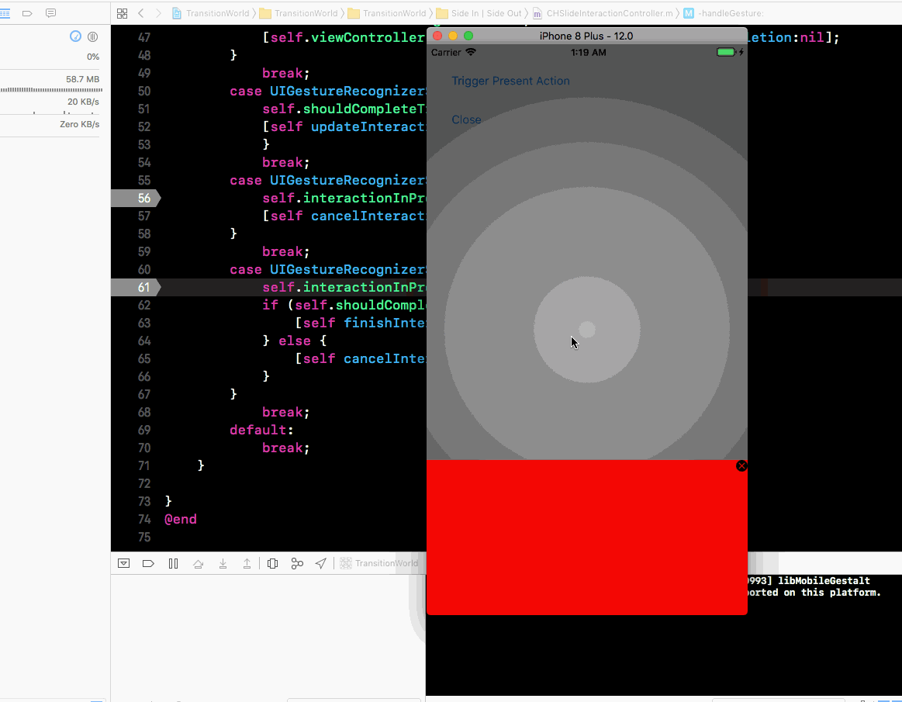

> Theme: Computer underlying knowledge 
> Source Code Read Plan:
> - [ ] GCD 底层libdispatch
> - [ ] `objc_msgSend` 汇编实现
> - [ ] Custom UIViewController Transitions (随便写几个demo实现玩)

# 2018/09/03

[可交互式的滑入滑出效果](https://github.com/colourful987/2018-Read-Record/tree/master/Content/iOS/TransitionWorld/TransitionWorld/Transition%20Demo/Demo3)

效果如下：



核心系统方法：

```oc
// UIPercentDrivenInteractiveTransition 三个核心方法
[self updateInteractiveTransition:progress]

[self cancelInteractiveTransition]

[self finishInteractiveTransition]
```

然后在代理方法中返回这个 InteractionController 对象即可

```
- (id<UIViewControllerInteractiveTransitioning>)interactionControllerForDismissal:(id<UIViewControllerAnimatedTransitioning>)animator {
    if (self.slideInteractionController.interactionInProgress) {
        return self.slideInteractionController;
    }
    
    return nil;
}
```

> 总结：转场动画为了可复用性，定义了太多的协议，因此一定要搞清楚各自的职责。
> 从层级最高的来讲是 `UIViewControllerTransitioningDelegate` ，也就是我们经常设置的`delegate`，它从大方向上指明了我们应该可选的不同职责的对象：

1. 转场显示的动画对象(`animationControllerForPresentedController`)；
2. 转场消失的动画对象(`animationControllerForDismissedController`)；
3. 可交互的动画显示对象(`interactionControllerForPresentation`)；
4. 可交互的动画消息对象(`interactionControllerForDismissal`)；
5. 呈现方式(`presentationControllerForPresentedViewController`);

> 如上所述每一个动画/可交互对象同样需要时遵循协议的，比如动画的需要`UIViewControllerAnimatedTransitioning`协议;可交互式对象为`UIViewControllerInteractiveTransitioning`协议；呈现的对象干脆就是一个封装好的基类`UIPresentationController`

码代码过程中，如果我们二次封装，我觉得动画对象应该持有一个可交互式的对象，但是要以依赖注入的方式！

遗留问题：
1. 当progress进度小于0.5放手时也执行了dismiss操作，这个是不合理的;
2. 实例化一个 InteractionController 的方式需要把手势加载到sourceViewController的view上，项目中过早的调用 viewController.view可能导致视图控制器LifeCycle生命周期错乱的可能性。


# 2018/09/05

[右上角圆形发散式转场，参照Raywenderlich](https://github.com/colourful987/2018-Read-Record/tree/master/Content/iOS/TransitionWorld/TransitionWorld/Transition%20Demo/Demo4)

效果如下：


# 2018/09/06
重要事情说三遍：
1. **只要设置**`destinationVC.transitioningDelegate = self`就可以了，如果没有实现自定义呈现类，**不要设置**`destinationVC.modalPresentationStyle = UIModalPresentationCustom`!!!
2. **只要设置**`destinationVC.transitioningDelegate = self`就可以了，如果没有实现自定义呈现类，**不要设置**`destinationVC.modalPresentationStyle = UIModalPresentationCustom`!!!
3. **只要设置**`destinationVC.transitioningDelegate = self`就可以了，如果没有实现自定义呈现类，**不要设置**`destinationVC.modalPresentationStyle = UIModalPresentationCustom`!!!

mmp的转成present的时候往 `transitionContext.containerView`(系统提供的`UITransitionView`) add子视图是没有问题的，但是dismiss的时候却“不正常”，动画正确地执行，然后黑屏！其实“不正常”是情理之中的事情，因为设置了 `destinationVC.modalPresentationStyle = UIModalPresentationCustom;`，系统会向delegate询问关于呈现（Presentation）由谁负责：

```oc
// 如下写法
- (UIPresentationController *)presentationControllerForPresentedViewController:(UIViewController *)presented presentingViewController:(UIViewController *)presenting sourceViewController:(UIViewController *)source {
    return [[DimmingPresentationController alloc] initWithPresentedViewController:presented presentingViewController:presenting];
}

// 附上DimmingPresentationController的实现

@interface DimmingPresentationController()
@property(nonatomic, strong)CHGradientView *dimmingView;
@end

@implementation DimmingPresentationController

- (void)presentationTransitionWillBegin {
    self.dimmingView.frame = self.containerView.bounds;
    [self.containerView insertSubview:self.dimmingView atIndex:0];
    self.dimmingView.alpha = 0;
    
    id <UIViewControllerTransitionCoordinator> transitionCoordinator =  self.presentedViewController.transitionCoordinator;
    
    if (transitionCoordinator) {
        [transitionCoordinator animateAlongsideTransition:^(id<UIViewControllerTransitionCoordinatorContext>  _Nonnull context) {
            self.dimmingView.alpha = 1;
        } completion:nil];
    }
}

- (void)dismissalTransitionWillBegin {
    id <UIViewControllerTransitionCoordinator> transitionCoordinator =  self.presentedViewController.transitionCoordinator;
    
    if (transitionCoordinator) {
        [transitionCoordinator animateAlongsideTransition:^(id<UIViewControllerTransitionCoordinatorContext>  _Nonnull context) {
            self.dimmingView.alpha = 0;
        } completion:nil];
    }
}

// 如果是半屏的话 这个属性设置为NO 表明不移除当前视图
- (BOOL)shouldRemovePresentersView {
    return NO;
}

- (CHGradientView *)dimmingView {
    if (!_dimmingView) {
        _dimmingView = [[CHGradientView alloc] initWithFrame:CGRectZero];
    }
    return _dimmingView;
}
@end
```

说一个视图是 `presentedViewController` 还是 `presentingViewController` ，是有个相对关系的，一定要说 A 是 B 的 `presentedViewController/presentingViewController`。

一个视图控制器即可以是`presentedViewController` 也可以是 `presentingViewController`，比如 A present B, B present C，那么 B 就扮演了两个角色，B是A的 presentedViewController，又是C的presentingViewController；
A 则简单点，是B的presentingViewController；C则只有一种角色，是B的presentedViewController。