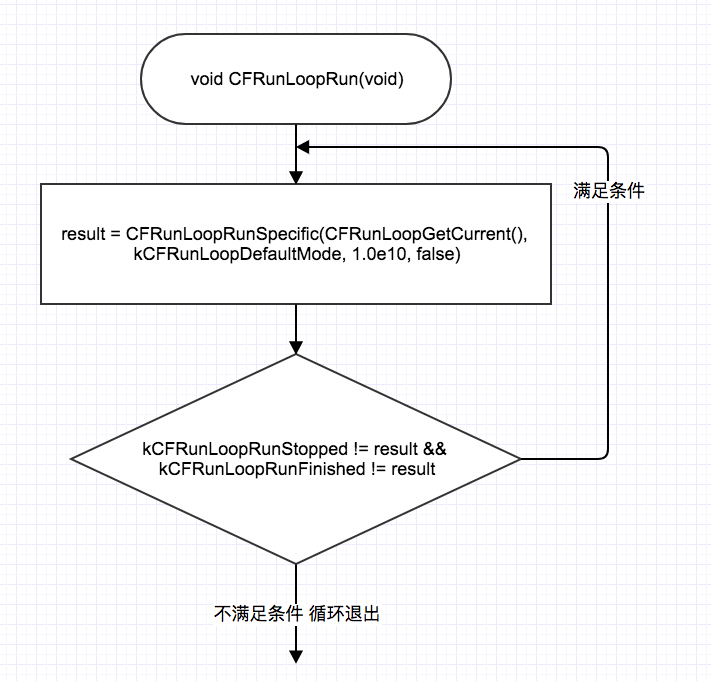
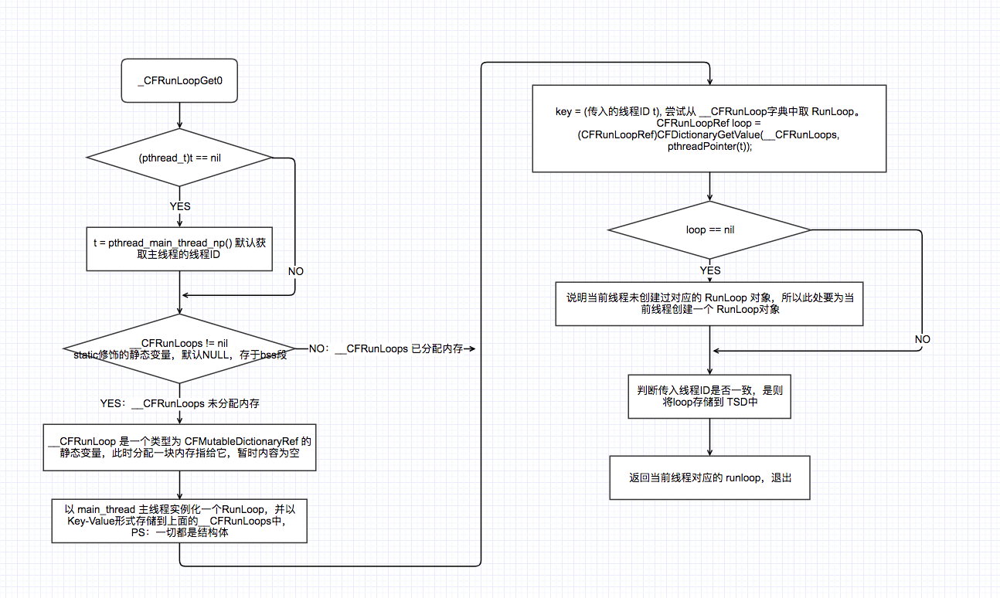

# 1. CFRunLoopRun
总流程图：其中 `CFRunLoopRunSpecific` 方法实现是一套设计好的工作流程，针对不同的事件作出对应的响应处理，用枚举标识处理结果，可以看到结果状态为 `kCFRunLoopRunStopped` 或 `kCFRunLoopRunFinished` 时退出 while 循环：



当然类似：
```
do {
  ret = doSomething();
}while(ret);
```
上述代码存在一个问题，`doSomething` 如果一直返回 1，会导致无限循环，CPU 占据 100 % 使用率，这可以理解，因为始终保持工作状态。但是应用程序并非一直处于工作状态，所以在空闲时可以让进程休眠，一旦有事件产生，则唤醒应用处理。

举个例子：响应键盘输入，做出不同处理。有两种方式：方式一、轮询，即不断查询GPIO引脚高低电平值，但是这样做会导致CPU负荷很大，为了减轻CPU的压力，又能及时响应键盘输入，我们可以每隔100ms查询一次状态，假设只要查询状态代码耗时 10ms，那么工作时间占比是 10/110 ≈ 10%而已，如何设定时间间隔 100ms 呢？如下方式就可以了：

```
// 关于i,j的范围设定 并非是1000
for (int i = 0;i<1000;i++){
  for (int j = 0; j< 1000;j++){
    // NoOp
  }
}
```

首先这段代码双循环，但是未处理任何事务(No Operation)，所以 CPU 会自动切换到休眠状态，把时间片释放给其他进程使用，至于休眠多久，就这里 i =1000和j=1000是根据晶振频率决定。

方式二：中断，即默认休眠状态，只有当GPIO发生高低电平变化了触发硬件中断，跳入到中断处理代码。

两种方式区别在于一个主动，一个被动，后者响应准确且及时，避免不必要的CPU消耗。

**遗留问题：**
1. `CFRunLoopRun` 的 caller 是谁？

# 2. CFRunLoopGetCurrent

RunLoop 和线程一一对应，通过 `pthread_self()` 获取到当前线程信息的指针，类型为 `pthread_t`。

* `CHECK_FOR_FORK`:
* `_CFGetTSD` 线程特有数据，TSD:Thread-Specific Data，即一个线程内部的各个函数都能访问、但其他线程不能访问的变量，这种机制还称之为线程局部静态变量（Static memory local to a thread）或线程局部存储（TLS:Thread-Local storage），更多请见[Linux中的线程局部存储一文](https://blog.csdn.net/cywosp/article/details/26469435);
* `_CFRunLoopGet0(pthread_self())` 是大部分博客讲解的重点：每个线程在fork的时候得到唯一的一个 `pthread_t` 结构体指针，以它为key，value为RunLoop对象存储到一个全局字典中，按照代码逻辑来说，先从字典中尝试获取当前线程对应的runloop对象，获取直接返回，没有则创建一个，存储同时返回;

```objective-c
CFRunLoopRef CFRunLoopGetCurrent(void) {
    CHECK_FOR_FORK();
    CFRunLoopRef rl = (CFRunLoopRef)_CFGetTSD(__CFTSDKeyRunLoop);
    if (rl) return rl;
    return _CFRunLoopGet0(pthread_self());
}
```

**遗留问题：**
1. 为何有两种存储方式：TSD 和 CFMutableDictionaryRef；为何先从TSD尝试获取？

## 2.1 _CFRunLoopGet0

这里涉及的知识点不多，1. `__CFRunLoops` 静态字典变量作为cache，key=线程ID(pthread_t type) value=runloop；2.懒加载？其实也不算 3.所有的实现都是基于结构体，结构体比平常用到复杂一些，主要是成员多是函数指针;4.runloop结构体我觉得更像是一份配置描述：`CFMutableSetRef _modes`，内含多个运行mode配置，在不同事件下以配置好的mode加载运行，运行在那个`do{}while(1)` 代码块中，代码块要做的工作就是根据这个mode配置和处理流程做事罢了。


# 3. CFRunLoopRunSpecific

